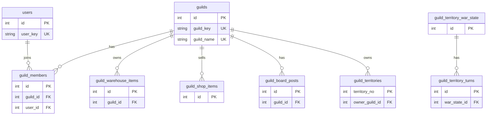
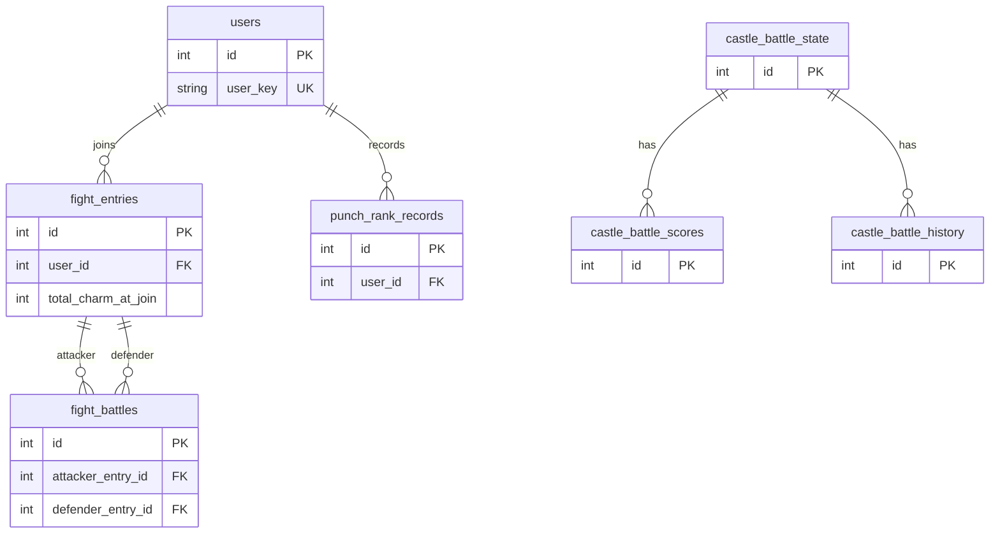
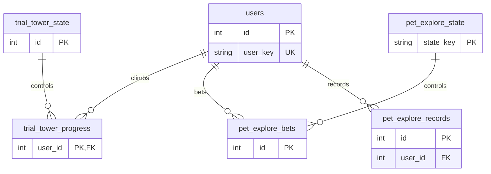
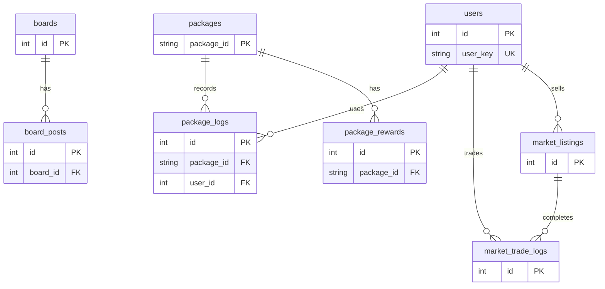
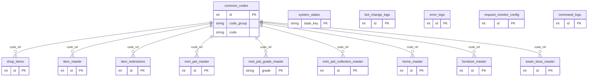

# 호이봇 RDB 테이블 연관도

`rdb_erd.md`의 테이블 설계를 기준으로 도메인별 관계를 나눈 Mermaid ERD이다.

## 회원 중심

```mermaid
erDiagram
    users ||--|| user_progress : has
    users ||--o{ user_roles : has
    users ||--o{ user_items : owns
    users ||--o{ user_currencies : owns
    users ||--o{ currency_logs : records
    users ||--|| user_pets : has
    users ||--o{ user_pet_skills : owns
    users ||--o{ user_titles : owns
    users ||--|| user_homes : has
    users ||--o{ user_home_furniture : owns
    users ||--o{ user_home_comments : writes_or_receives
    users ||--o{ user_mini_pets : owns
    users ||--|| user_mini_pet_battle_stats : has
    users ||--o{ user_mini_pet_collections : owns

    users {
      int id PK
      string user_key UK
    }
    user_progress {
      int user_id PK, FK
    }
    user_roles {
      int id PK
      int user_id FK
    }
    user_items {
      int id PK
      int user_id FK
    }
    user_currencies {
      int id PK
      int user_id FK
    }
    currency_logs {
      int id PK
      int user_id FK
    }
    user_pets {
      int id PK
      int user_id FK
    }
    user_pet_skills {
      int id PK
      int user_id FK
    }
    user_titles {
      int id PK
      int user_id FK
    }
    user_homes {
      int user_id PK, FK
    }
    user_home_furniture {
      int id PK
      int user_id FK
    }
    user_home_comments {
      int id PK
      int home_user_id FK
      int writer_user_id FK
    }
    user_mini_pets {
      int id PK
      int user_id FK
    }
    user_mini_pet_battle_stats {
      int user_id PK, FK
    }
    user_mini_pet_collections {
      int id PK
      int user_id FK
    }
```

## 길드/영지

```mermaid
erDiagram
    guilds ||--o{ guild_members : has
    guilds ||--o{ guild_warehouse_items : owns
    guilds ||--o{ guild_shop_items : sells
    guilds ||--o{ guild_board_posts : has
    guilds ||--o{ guild_territories : owns
    guild_territory_war_state ||--o{ guild_territory_turns : has

    users ||--o{ guild_members : joins

    guilds {
      int id PK
      string guild_key UK
      string guild_name UK
    }
    guild_members {
      int id PK
      int guild_id FK
      int user_id FK
    }
    guild_warehouse_items {
      int id PK
      int guild_id FK
    }
    guild_shop_items {
      int id PK
    }
    guild_board_posts {
      int id PK
      int guild_id FK
    }
    guild_territories {
      int territory_no PK
      int owner_guild_id FK
    }
    guild_territory_war_state {
      int id PK
    }
    guild_territory_turns {
      int id PK
      int war_state_id FK
    }
    users {
      int id PK
      string user_key UK
    }
```

## 맞짱/캐슬/랭킹

```mermaid
erDiagram
    users ||--o{ fight_entries : joins
    fight_entries ||--o{ fight_battles : attacker
    fight_entries ||--o{ fight_battles : defender
    users ||--o{ punch_rank_records : records

    castle_battle_state ||--o{ castle_battle_scores : has
    castle_battle_state ||--o{ castle_battle_history : has

    fight_entries {
      int id PK
      int user_id FK
      int total_charm_at_join
    }
    fight_battles {
      int id PK
      int attacker_entry_id FK
      int defender_entry_id FK
    }
    punch_rank_records {
      int id PK
      int user_id FK
    }
    castle_battle_state {
      int id PK
    }
    castle_battle_scores {
      int id PK
    }
    castle_battle_history {
      int id PK
    }
    users {
      int id PK
      string user_key UK
    }
```

## 시련의탑/펫탐험/이벤트

```mermaid
erDiagram
    users ||--o{ trial_tower_progress : climbs
    trial_tower_state ||--o{ trial_tower_progress : controls
    users ||--o{ pet_explore_bets : bets
    users ||--o{ pet_explore_records : records
    pet_explore_state ||--o{ pet_explore_bets : controls

    trial_tower_progress {
      int user_id PK, FK
    }
    trial_tower_state {
      int id PK
    }
    pet_explore_bets {
      int id PK
    }
    pet_explore_records {
      int id PK
      int user_id FK
    }
    pet_explore_state {
      string state_key PK
    }
    users {
      int id PK
      string user_key UK
    }
```

## 게시판/시장/패키지

```mermaid
erDiagram
    boards ||--o{ board_posts : has
    market_listings ||--o{ market_trade_logs : completes
    users ||--o{ market_listings : sells
    users ||--o{ market_trade_logs : trades
    packages ||--o{ package_rewards : has
    packages ||--o{ package_logs : records
    users ||--o{ package_logs : uses

    boards {
      int id PK
    }
    board_posts {
      int id PK
      int board_id FK
    }
    market_listings {
      int id PK
    }
    market_trade_logs {
      int id PK
    }
    packages {
      string package_id PK
    }
    package_rewards {
      int id PK
      string package_id FK
    }
    package_logs {
      int id PK
      string package_id FK
      int user_id FK
    }
    users {
      int id PK
      string user_key UK
    }
```

## 기준표/운영

```mermaid
erDiagram
    common_codes ||--o{ shop_items : code_ref
    common_codes ||--o{ item_master : code_ref
    common_codes ||--o{ item_restrictions : code_ref
    common_codes ||--o{ mini_pet_master : code_ref
    common_codes ||--o{ mini_pet_grade_master : code_ref
    common_codes ||--o{ mini_pet_collection_master : code_ref
    common_codes ||--o{ home_master : code_ref
    common_codes ||--o{ furniture_master : code_ref
    common_codes ||--o{ tower_boss_master : code_ref

    common_codes {
      int id PK
      string code_group
      string code
    }
    system_states {
      string state_key PK
    }
    shop_items {
      int id PK
    }
    item_master {
      int id PK
    }
    item_restrictions {
      int id PK
    }
    mini_pet_master {
      int id PK
    }
    mini_pet_grade_master {
      string grade PK
    }
    mini_pet_collection_master {
      int id PK
    }
    home_master {
      int id PK
    }
    furniture_master {
      int id PK
    }
    tower_boss_master {
      int id PK
    }
    bot_change_logs {
      int id PK
    }
    error_logs {
      int id PK
    }
    request_monitor_config {
      int id PK
    }
    command_logs {
      int id PK
    }
```

