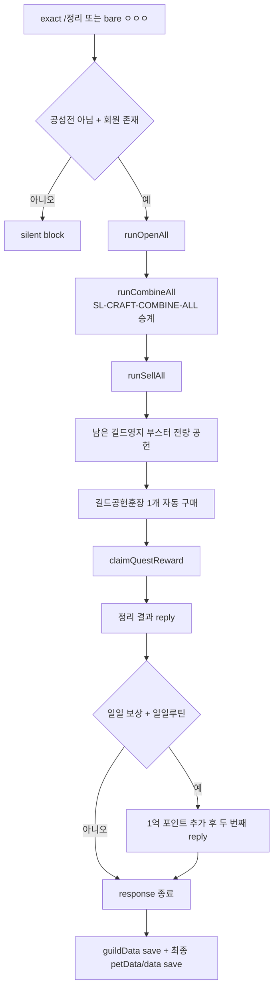

# SL-INVENTORY-CLEANUP-ORCHESTRATION 분류·설계

- 작업자: 윤슬
- 실행 ID: `윤슬-SL-INVENTORY-CLEANUP-ORCHESTRATION-20260818T062329Z-oa0vw2`
- 기준 소스: `a39cd995ad2cdc2c97bcb82ed8a320150578d4ae`
- 범위: 현행 조사와 DB 매핑 설계만 수행
- 비범위: runtime source, migration, 시험/운영 DB, 운영 JSON, 합성 실행, 구현, 통합, parity, Shadow, 운영 준비

## 명령 분류

`명령어_이관`의 현재 값을 읽어 확인했으며 사용 상태는 변경하지 않았다.

| 분류 | CMD ID | 명령 | 사용 상태 | 이번 슬라이스 처리 |
|---|---|---|---|---|
| 직접 대표 | CMD-03-0131 | `/정리`, bare `ㅇㅇㅇ` | 사용 | 신규 슬라이스 주요 매핑 |
| 오픈 하위 기능 | CMD-06-0081 | `/전체오픈` | 사용 | 별도 하위 슬라이스 후보 |
| 판매 하위 기능 | CMD-02-0027 | `/전체판매` | 사용 | 별도 하위 슬라이스 후보 |
| 조합 지원 의존성 | CMD-06-0082, CMD-06-0083 | `/전체조합`, `/전체조합2` | 사용 | 통합된 `SL-CRAFT-COMBINE-ALL` 승계, 재개발 금지 |
| 길드 공헌 하위 기능 | CMD-04-0010, CMD-04-0018 | `/길드공헌`, `/길드부스터공헌 [숫자]` | 사용 | 별도 길드 하위 슬라이스 후보 |
| 퀘스트 하위 기능 | CMD-11-0022 | `/퀘스트완료`, `ㅎㅎㅎ`, `/ㅇ`, `/ㅇㅇㅇ` | 사용 | 별도 퀘스트 하위 슬라이스 후보 |
| 운영 문구 의존성 | CMD-07-0035 | `/정리알림 [인자]` | 사용 | 읽기 의존성, 오케스트레이션 구현 대상 아님 |
| 길드 패키지 하위 기능 | CMD-04-0049, CMD-04-0050 | `/길드창고패키지오픈` exact/숫자 | 사용 | `runOpenAll` 하위 슬라이스에서 분류 |
| 일반 박스 하위 기능 | CMD-06-0045, CMD-06-0097 | `/상자오픈`, `/특식오픈` | 사용 | `runOpenAll` 하위 슬라이스에서 분류 |
| 탐험 박스 하위 기능 | CMD-09-0012/0013, CMD-06-0006/0007, CMD-06-0070/0071, CMD-06-0113/0114, CMD-06-0075/0076, CMD-06-0058/0059, CMD-06-0120/0121, CMD-06-0031, CMD-10-0006, CMD-06-0051, CMD-10-0013, CMD-06-0017/0018, CMD-04-0062/0063, CMD-09-0031/0032, CMD-06-0027, CMD-14-0003 | `openExploreBoxesAllForOpenAll`이 여는 13종 명령형 박스 | 사용 | 오픈 하위 슬라이스의 지원 명령군 |

bare `ㅇㅇㅇ`은 `/정리` 별칭이다. 선행 슬래시가 있는 `/ㅇㅇㅇ`은 `CMD-11-0022 /퀘스트완료` 별칭이므로 서로 다른 입력으로 고정한다. 연결된 실제 명령 중 `미사용 검토` 상태는 없었다. 인접한 `CMD-09-0021 /정령패키지`는 `미사용 검토`이나 현행 정리 호출 그래프에 없으므로 결정 대기 대상으로만 남기고 매핑하거나 구현하지 않는다.

## 현행 guard와 호출 순서

- 공통 outer guard는 `/전체오픈`, `/전체판매`, `/전체조합`, `/정리`, bare `ㅇㅇㅇ`의 exact equality 묶음이다.
- 정리 branch는 `!castleSiegeFlag && data.member && data.member[sender]`일 때만 실행한다.
- 가입되지 않은 사용자는 앞선 공통 response 회원 gate에서도 차단된다.
- 정리 알림은 `getOperationNotice(data, "cleanup")`으로 읽어 결과 머리말에 포함한다.

## helper 입출력과 mutation

| 순서 | helper/inline 단계 | 입력 | 반환·출력 | 주요 mutation | 현행 save·실패 특성 |
|---:|---|---|---|---|---|
| 1 | `runOpenAll` | sender, data, petData, replier, guildData | 집계 문자열 | 동일 member bag의 박스 삭제·보상 추가, point 추가, 길드 공헌/창고 자원 변경, 탐험 박스 보상 추가 | 내부 저장은 없고 난수 사용. 여러 도메인 mutation을 한 함수에 포함 |
| 1-a | local `openBox`/`openFixedBox`/`openRandomBox` | bag 및 확률 | 결과 배열 누적 | 상자 삭제, 아이템/point 추가 | `Math.random` 반복; 재실행 시 결과가 달라짐 |
| 1-b | local `openGuildContribution` | data, guildData, bag | 결과 배열 누적 | 훈장 전량 삭제, 길드 contribution/exp, 개인 count, 보상 아이템 | 길드 미가입이면 훈장을 남기고 실패 문구만 누적 |
| 1-c | local `openGuildWarehousePackage` | data, guildData, bag | 결과 배열 누적 | 패키지 삭제, 길드 창고 자원 추가 | 길드 오류면 패키지를 남김 |
| 1-d | `openExploreBoxesAllForOpenAll` | sender, data, petData | 탐험 박스별 집계 문자열 | 13종 박스 전량 삭제 후 roll 결과를 bag에 추가 | roll 함수군은 하위 슬라이스에서 순수성·부가 mutation 재검증 필요 |
| 2 | `runCombineAll` | sender, data | 조합 결과 또는 부족 문구 | 정령조각 10개당 강화석 1개 최대 변환 | 완료된 `SL-CRAFT-COMBINE-ALL` 서비스 재사용 |
| 3 | `runSellAll` | sender, data, petData, guildData | 판매 집계 또는 판매 없음 문구 | 판매금지 목록이 아닌 남은 bag 항목 삭제, point 증가 | `itemListPath`를 함수 안에서 두 번 load; load/parse 실패 시 상위 catch |
| 4 | `contributeGuildTerritoryBooster` | data, petData, guildData, sender, 전량 | ok/message/count | booster 제거, 개인·길드 contribution count 증가 | 성공 직후 data 저장. 길드 save는 outer block 뒤에서 수행 |
| 5 | 길드 훈장 자동구매 inline | data, guildData, sender | 결과 문자열 추가 | point 차감, `applyTax`, 훈장 1개 추가, daily buy count 증가 | 별도 즉시 save 없음. 앞 단계 판매가 끝난 뒤 구매되어 새 훈장은 이번 정리에서 판매되지 않음 |
| 6 | `claimQuestReward` | data, petData, guildData, petSkillData, sender | claimed flags + message | 일/주간/패스 보상 bag·count·point 변경 | message가 있으면 data 즉시 저장 |
| 7 | 일일루틴 보너스 inline | quest result, petSkillData | 두 번째 reply | point 1억 추가 | 첫 reply 뒤 mutation; 최종 data save에 의존 |

순서 parity가 중요하다. 오픈이 만든 정령조각은 같은 실행에서 조합되며, 그 뒤 판매 대상이 정리된다. `openPetFoodBox`는 `openPetFoodSpecial`보다 먼저 실행되므로 특식이 새로 만든 먹이상자는 같은 실행에서 다시 열리지 않는다. 퀘스트 보상은 판매 뒤 지급되어 같은 실행에서 열리거나 팔리지 않는다.

## 현행 transaction과 부분 성공 위험

`response`는 `dataTransactionLock`을 획득하고 `beginDataSaveTransaction()`을 시작한다. 관리 JSON 저장은 즉시 파일에 기록되지만, 각 경로의 실행 전 backup을 최초 한 번 등록한다. 예외가 상위 catch까지 전파되면 저장된 경로를 역순 복구한다. 따라서 이는 DB transaction이 아니라 보상 복구형 파일 transaction이다.

- 메모리 mutation과 여러 JSON 파일 저장 사이에는 실제 단일 commit 지점이 없다.
- `data`는 booster와 quest 단계에서 중간 저장될 수 있고, `guildData`는 outer block 끝, `petData`와 `data`는 response 끝에서 저장된다.
- backup 복구가 성공해도 이미 전송된 reply는 취소할 수 없다.
- 정리 본문 reply 뒤 일일루틴 point를 추가하므로, 그 뒤 저장 실패 시 사용자는 성공 reply를 받았지만 파일은 rollback될 수 있다.
- helper가 실패 객체를 반환하는 경우는 전체 rollback이 아니라 해당 단계만 건너뛰고 다음 단계가 계속될 수 있다.
- 난수 결과를 기록하기 전에 재시작하면 동일 이벤트의 재실행 결과가 달라질 수 있다.

## 목표 transaction 경계

DB 이관 시 `/정리` 한 이벤트는 하나의 상위 transaction으로 묶는다.

1. event/idempotency key와 player를 잠그고 기존 `command_executions`를 조회한다.
2. 필요한 inventory stacks, currency account, guild/member/shop/quest rows를 고정된 순서로 잠근다.
3. 오픈 난수 계획을 한 번 생성해 operation payload에 고정한다.
4. 오픈 → 승계된 전체조합 → 판매 → booster → 훈장 구매/세금 → quest → routine bonus 순서로 같은 DB connection에서 mutation한다.
5. inventory/currency/guild ledger, operation, child step audit, command execution, ordered outbox를 같은 transaction에 기록한다.
6. 모두 성공하면 한 번 commit하고, reply는 commit된 outbox만 순서대로 delivery한다.
7. 어떤 단계든 예외면 전체 rollback한다. 정책상 실패를 허용하는 단계는 예외가 아니라 명시적 skipped result로 기록한다.

정리 결과 reply와 일일루틴 reply의 두 메시지 parity가 필요하면 outbox sequence 1, 2로 보존한다. 중복 이벤트와 재시작은 기존 execution/outbox를 재사용하고 state mutation과 delivery를 추가하지 않는다.

## 슬라이스 경계 결정

| 슬라이스 | 소유 범위 | 이유 |
|---|---|---|
| `SL-INVENTORY-CLEANUP-ORCHESTRATION` | exact dispatch, guard, 단계 순서, 상위 idempotency/transaction, 결과 조립, ordered outbox | 여러 도메인 단계를 한 이벤트로 결속 |
| `SL-INVENTORY-CLEANUP-OPEN-ALL` 제안 | `runOpenAll`, 모든 local opener, 13종 탐험 roll 연결 | 난수·bag·point·guild mutation이 커서 독립 parity 필요 |
| `SL-INVENTORY-CLEANUP-SELL-ALL` 제안 | `runSellAll`, 판매금지 catalog, point ledger | item catalog 및 판매 정책을 독립 검증해야 함 |
| `SL-CRAFT-COMBINE-ALL` 기존 | `runCombineAll` 대응 서비스 | 이미 통합·Shadow 완료, 재개발 금지 |
| 길드 contribution/warehouse/booster 하위 슬라이스 제안 | 공헌, 창고 패키지, booster, 길드 레벨업 | 길드 row와 개인 inventory의 교차 mutation |
| 길드 shop medal 하위 슬라이스 제안 | 훈장 구매, 일 제한, castle tax | currency·tax·shop limit 원자성 필요 |
| daily quest reward 하위 슬라이스 제안 | `claimQuestReward`, routine bonus | quest counters·보상·두 번째 reply parity 필요 |

각 하위 슬라이스는 standalone 명령도 소유하되, parent가 호출할 때는 자체 commit/outbox delivery를 하지 않고 같은 transaction context에 결과만 반환해야 한다.

## DB 매핑 초안

- authoritative: `inventory_stacks`, `currency_accounts`, guild membership/warehouse/territory/shop, daily quest state
- reference: `item_definitions`, sell policy catalog, operation notice/config, reward/roll catalog
- evidence: `inventory_ledger`, `currency_ledger`, guild ledger, `operations`, `command_executions`, `command_audit`, `outbox_messages`
- 관계: player와 guild의 mutation을 parent operation 하나에 결속하고 각 단계는 ordinal과 child slice ID를 audit payload에 기록
- migration: 이번 분류 실행에서는 미작성. 기존 inventory/catalog/ledger/audit/outbox 구조 재사용을 우선하고, 길드·퀘스트 스키마는 각 하위 슬라이스에서 확정

## 합성 시나리오 설계

| 시나리오 | fixture 핵심 | 기대 결과 |
|---|---|---|
| 정상 | 여러 상자, 조각 20+, 판매 가능 item, booster, 훈장 구매 가능, 완료 quest | 순서 parity, 모든 ledger/audit, ordered reply, 1회 commit |
| 빈 가방 | 빈 stacks, 미완료 quest | mutation 없음 또는 허용된 quest 결과만, 판매/조합 없음 문구 parity |
| 부분 재료 | 조각 1~9, 일부 박스, 포인트 부족 | 조합 없음, 가능한 단계만 skipped/success로 기록, 잔량 보존 |
| 여러 조합 동시 | 정령박스와 기존 조각, 특식과 먹이상자, 여러 탐험박스 | 오픈 생성물의 같은 실행 소비 여부와 호출 순서 정확 일치 |
| 중간 실패 | open 이후 또는 combine/판매/quest 사이 fault injection | 전체 DB rollback, state/ledger/outbox 0, 재시도 가능 |
| 중복 event | 동일 event key를 동시·순차 2회 전송 | state mutation 1회, execution 1회, delivery 최대 1세트 |
| 재시작 replay | commit 후 delivery 전 재시작, commit 전 강제 종료 | commit 후에는 outbox만 재전송, commit 전에는 전체 재실행하되 난수 계획/멱등성 계약 보존 |

## 남은 위험

- `runOpenAll`의 local helper가 여러 도메인 mutation을 숨기며 roll 함수군의 순수성은 하위 조사 필요.
- `runSellAll` 내부 파일 load 두 번과 판매금지 catalog의 authoritative source를 통합 전에 고정해야 한다.
- 현행 파일 rollback은 external reply를 되돌리지 못한다.
- 길드 미가입, 포인트 부족, 일 제한처럼 정상 skip으로 처리되는 조건과 진짜 실패의 경계를 명시해야 한다.
- random 결과·세금·guild level-up·quest reward의 정확한 legacy message parity는 구현 슬라이스에서 fixture로 고정해야 한다.

