# hoiBot MariaDB 설계 ERD

- 설계 버전: `029_pre_signup_attendance`
- 검증 DB: `hoibot_schema_design`
- 문자셋: `utf8mb4 / utf8mb4_unicode_ci`
- 원칙: 운영 JSON 값을 그대로 보관하는 dump table 없이 도메인 row로 정규화한다.
- 데이터 단계: 이 문서는 schema만 정의한다. 운영 데이터 전체 이관은 기능 parity와 통합 검증 뒤 마지막 단계에서만 수행한다.

## 핵심 식별자·실행·원장

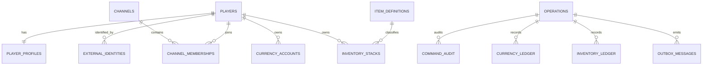

## 사용자·펫·홈

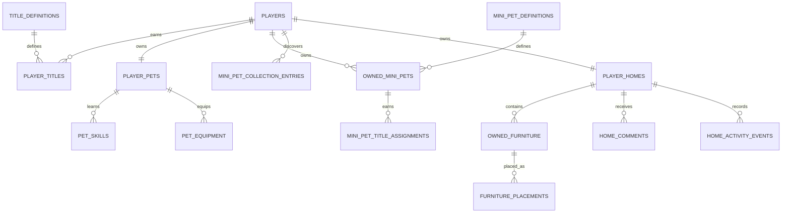

## 길드·커뮤니티·공성전

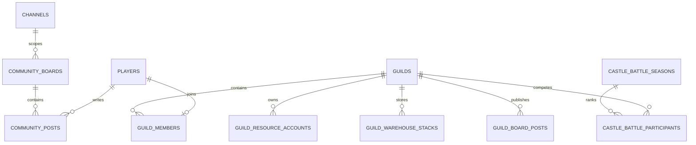

## 이벤트·상품·시장

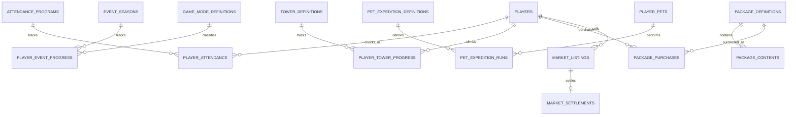

## 운영·이관

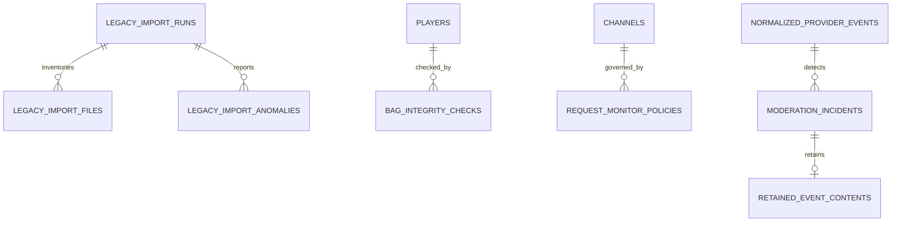

## authoritative 저장소 매핑

| 기존 저장소 | 목적 테이블 |
|---|---|
| `attendanceLight.json` | 가입 전 `pre_signup_attendance`, 가입 완료 후 `player_attendance`·`player_counters` |
| `board.json`, `carrotBoard.json` | `community_boards`, `community_posts` |
| `castleBattle2.json` | `castle_battle_seasons`, `castle_battle_participants` |
| `currencyLog.json` | `currency_ledger` |
| `freeMarket.json` | `market_listings`, `market_settlements`, `market_events`, `market_fee_ledger` |
| `guildData.json` | `guilds`, `guild_members`, `guild_roles`, `guild_resource_accounts`, `guild_warehouse_stacks` |
| `itemList.json` | `item_definitions`, `inventory_stacks`, `inventory_instances` |
| `member.json` | `players`, `player_profiles`, `currency_accounts`, `player_counters`, `player_passes`, `player_badge_assignments` |
| `member_pet.json`, `petSkillData.json` | `player_pets`, `pet_skills`, `pet_equipment` |
| `member_title.json`, `pet_title.json`, `miniPet_title.json` | `title_definitions`과 각 title assignment table |
| `miniPet_collection.json` | `mini_pet_collection_entries` |
| `memberBagCheck/memberBagCheck.json` | `bag_integrity_checks` |
| `packageInfo.json`, `packageLog.json` | `package_definitions`, `package_contents`, `package_purchases` |
| `petExploreData.json` | `pet_expedition_definitions`, `pet_expedition_runs` |
| `petSweetHomeData.json` | `player_homes`, `owned_furniture`, `furniture_placements` |
| `petHomeComments.json` | `home_comments` |
| `petHomeActivityData.json` | `home_visits`, `home_reactions`, `home_activity_events` |
| `petHomePlacedFurniture.json` | `furniture_placements` |
| `punchRankData.json` | `leaderboards`, `leaderboard_entries` |
| `trialTower.json` | `tower_definitions`, `player_tower_progress` |
| `requestMonitorConfig.json` | `request_monitor_policies` |

## 설계 경계

- 금액·수량 변경은 `operations`와 해당 ledger를 같은 transaction에서 기록한다.
- 사용자·길드·아이템 삭제는 운영 기록 보존을 위해 기본 `RESTRICT`다.
- 원문이 필요한 게시글·댓글만 `TEXT`를 사용하고, 규칙·정의 확장값에만 `JSON`을 허용한다.
- `legacy_import_*`는 실행 증거와 anomaly용이며 운영 JSON payload 보관소가 아니다.
- 누락 운영 파일 2개는 합성 fixture로 schema와 로직만 검증하며 최종 이관 증거로 인정하지 않는다.

<!-- GENERATED COLUMN ERD START -->
## 전체 물리 컬럼 ERD

이 섹션은 Docker MariaDB `hoibot_schema_design`의 `information_schema`에서 생성한다. 총 125개 테이블, 893개 컬럼이다.

### 식별자·채널

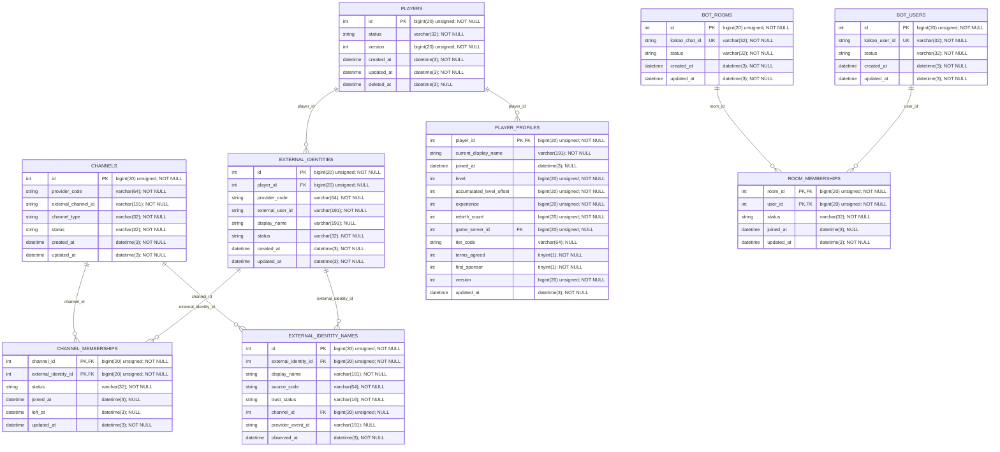

### 명령·실행·설정

```mermaid
erDiagram
  CHANNEL_SERVER_MAPPINGS {
    int channel_id PK,FK "bigint(20) unsigned; NOT NULL"
    int game_server_id FK "bigint(20) unsigned; NOT NULL"
    datetime effective_at "datetime(3); NOT NULL"
  }
  COMMAND_AUDIT {
    int id PK "bigint(20) unsigned; NOT NULL"
    int operation_id FK "bigint(20) unsigned; NOT NULL"
    string actor_type "varchar(32); NOT NULL"
    int actor_id "bigint(20) unsigned; NULL"
    string target_type "varchar(64); NULL"
    int target_id "bigint(20) unsigned; NULL"
    string action_code "varchar(128); NOT NULL"
    string result_code "varchar(64); NOT NULL"
    string reason "varchar(500); NULL"
    text change_summary_json "longtext; NULL"
    datetime created_at "datetime(3); NOT NULL"
  }
  COMMAND_EXECUTIONS {
    int id PK "bigint(20) unsigned; NOT NULL"
    string event_id FK "varchar(128); NOT NULL"
    string command_code "varchar(128); NOT NULL"
    int operation_id FK "bigint(20) unsigned; NOT NULL"
    string execution_status "varchar(32); NOT NULL"
    string result_code "varchar(64); NULL"
    datetime created_at "datetime(3); NOT NULL"
    datetime completed_at "datetime(3); NULL"
  }
  COMMON_CODE_GROUPS {
    string group_code PK "varchar(64); NOT NULL"
    string name "varchar(191); NOT NULL"
    int active "tinyint(1); NOT NULL"
  }
  COMMON_CODES {
    string group_code PK,FK "varchar(64); NOT NULL"
    string code PK "varchar(128); NOT NULL"
    string display_name "varchar(191); NOT NULL"
    int sort_order "int(11); NOT NULL"
    int active "tinyint(1); NOT NULL"
    text metadata_json "longtext; NULL"
    int version "bigint(20) unsigned; NOT NULL"
  }
  CONFIGURATION_CHANGE_LOG {
    int id PK "bigint(20) unsigned; NOT NULL"
    int configuration_set_id FK "bigint(20) unsigned; NOT NULL"
    int actor_id "bigint(20) unsigned; NULL"
    string action_code "varchar(64); NOT NULL"
    text change_json "longtext; NOT NULL"
    datetime created_at "datetime(3); NOT NULL"
  }
  CONFIGURATION_SETS {
    int id PK "bigint(20) unsigned; NOT NULL"
    string set_code "varchar(128); NOT NULL"
    int version "bigint(20) unsigned; NOT NULL"
    string status "varchar(32); NOT NULL"
    datetime effective_from "datetime(3); NULL"
    datetime effective_to "datetime(3); NULL"
    int approved_by "bigint(20) unsigned; NULL"
    datetime created_at "datetime(3); NOT NULL"
  }
  CONFIGURATION_VALUES {
    int configuration_set_id PK,FK "bigint(20) unsigned; NOT NULL"
    string config_key PK "varchar(191); NOT NULL"
    string value_type "varchar(32); NOT NULL"
    text string_value "text; NULL"
    decimal decimal_value "decimal(30,3); NULL"
    int integer_value "bigint(20); NULL"
    int boolean_value "tinyint(1); NULL"
    text json_value "longtext; NULL"
    text validation_json "longtext; NULL"
  }
  DELIVERY_ATTEMPTS {
    int id PK "bigint(20) unsigned; NOT NULL"
    int outbox_message_id FK "bigint(20) unsigned; NOT NULL"
    int attempt_no "int(10) unsigned; NOT NULL"
    string result_code "varchar(64); NOT NULL"
    string error_code "varchar(64); NULL"
    datetime attempted_at "datetime(3); NOT NULL"
  }
  EVENT_INBOX {
    string event_id PK "varchar(128); NOT NULL"
    string provider_code "varchar(64); NOT NULL"
    string provider_event_id "varchar(191); NULL"
    string external_channel_id "varchar(191); NULL"
    int channel_id FK "bigint(20) unsigned; NULL"
    string external_user_id "varchar(191); NULL"
    int external_identity_id FK "bigint(20) unsigned; NULL"
    string event_kind "varchar(64); NOT NULL"
    string event_origin "varchar(64); NULL"
    string direction "varchar(16); NOT NULL"
    string payload_hash "char(64); NOT NULL"
    string parse_status "varchar(32); NOT NULL"
    string processing_status "varchar(32); NOT NULL"
    datetime received_at "datetime(3); NOT NULL"
    datetime processed_at "datetime(3); NULL"
    int attempt_count "int(10) unsigned; NOT NULL"
    string error_code "varchar(64); NULL"
    datetime last_error_at "datetime(3); NULL"
  }
  GAME_SERVERS {
    int id PK "bigint(20) unsigned; NOT NULL"
    string code UK "varchar(64); NOT NULL"
    string display_name "varchar(191); NOT NULL"
    int active "tinyint(1); NOT NULL"
    int version "bigint(20) unsigned; NOT NULL"
    datetime created_at "datetime(3); NOT NULL"
    datetime updated_at "datetime(3); NOT NULL"
  }
  OPERATIONS {
    int id PK "bigint(20) unsigned; NOT NULL"
    string operation_key UK "char(36); NOT NULL"
    string idempotency_scope "varchar(128); NULL"
    string idempotency_key "varchar(191); NULL"
    string actor_type "varchar(32); NOT NULL"
    int actor_id "bigint(20) unsigned; NULL"
    string source_code "varchar(64); NOT NULL"
    string status "varchar(32); NOT NULL"
    text result_json "longtext; NULL"
    datetime created_at "datetime(3); NOT NULL"
    datetime completed_at "datetime(3); NULL"
  }
  OUTBOX_MESSAGES {
    int id PK "bigint(20) unsigned; NOT NULL"
    int operation_id FK "bigint(20) unsigned; NOT NULL"
    string provider_code "varchar(64); NOT NULL"
    string destination_id "varchar(191); NOT NULL"
    string message_type "varchar(64); NOT NULL"
    text payload_json "longtext; NOT NULL"
    string status "varchar(32); NOT NULL"
    int attempt_count "int(10) unsigned; NOT NULL"
    datetime available_at "datetime(3); NOT NULL"
    datetime sent_at "datetime(3); NULL"
    string last_error_code "varchar(64); NULL"
    datetime created_at "datetime(3); NOT NULL"
  }
  GAME_SERVERS ||--o{ CHANNEL_SERVER_MAPPINGS : "game_server_id"
  OPERATIONS ||--o{ COMMAND_AUDIT : "operation_id"
  EVENT_INBOX ||--o{ COMMAND_EXECUTIONS : "event_id"
  OPERATIONS ||--o{ COMMAND_EXECUTIONS : "operation_id"
  COMMON_CODE_GROUPS ||--o{ COMMON_CODES : "group_code"
  CONFIGURATION_SETS ||--o{ CONFIGURATION_CHANGE_LOG : "configuration_set_id"
  CONFIGURATION_SETS ||--o{ CONFIGURATION_VALUES : "configuration_set_id"
  OUTBOX_MESSAGES ||--o{ DELIVERY_ATTEMPTS : "outbox_message_id"
  OPERATIONS ||--o{ OUTBOX_MESSAGES : "operation_id"
```

### 재화·아이템·시장·패키지

```mermaid
erDiagram
  BAG_INTEGRITY_CHECKS {
    int id PK "bigint(20) unsigned; NOT NULL"
    int player_id FK "bigint(20) unsigned; NOT NULL"
    string source_checksum "char(64); NULL"
    int issue_count "bigint(20) unsigned; NOT NULL"
    datetime checked_at "datetime(3); NOT NULL"
    text detail_json "longtext; NULL"
  }
  CURRENCY_ACCOUNTS {
    int player_id PK,FK "bigint(20) unsigned; NOT NULL"
    string currency_code PK,FK "varchar(64); NOT NULL"
    decimal balance "decimal(30,3); NOT NULL"
    int version "bigint(20) unsigned; NOT NULL"
    datetime updated_at "datetime(3); NOT NULL"
  }
  CURRENCY_DEFINITIONS {
    string code PK "varchar(64); NOT NULL"
    string display_name "varchar(191); NOT NULL"
    int scale_digits "tinyint(3) unsigned; NOT NULL"
    int active "tinyint(1); NOT NULL"
  }
  CURRENCY_LEDGER {
    int id PK "bigint(20) unsigned; NOT NULL"
    int operation_id FK "bigint(20) unsigned; NOT NULL"
    int sequence_no "int(10) unsigned; NOT NULL"
    int player_id FK "bigint(20) unsigned; NOT NULL"
    string currency_code FK "varchar(64); NOT NULL"
    decimal delta "decimal(30,3); NOT NULL"
    decimal balance_after "decimal(30,3); NOT NULL"
    string reason_code "varchar(128); NOT NULL"
    datetime created_at "datetime(3); NOT NULL"
  }
  INVENTORY_INSTANCES {
    int id PK "bigint(20) unsigned; NOT NULL"
    int player_id FK "bigint(20) unsigned; NOT NULL"
    int item_id FK "bigint(20) unsigned; NOT NULL"
    string status "varchar(32); NOT NULL"
    text attributes_json "longtext; NULL"
    int version "bigint(20) unsigned; NOT NULL"
    datetime created_at "datetime(3); NOT NULL"
  }
  INVENTORY_LEDGER {
    int id PK "bigint(20) unsigned; NOT NULL"
    int operation_id FK "bigint(20) unsigned; NOT NULL"
    int sequence_no "int(10) unsigned; NOT NULL"
    int player_id FK "bigint(20) unsigned; NOT NULL"
    int item_id FK "bigint(20) unsigned; NOT NULL"
    int instance_id FK "bigint(20) unsigned; NULL"
    int quantity_delta "bigint(20); NOT NULL"
    string reason_code "varchar(128); NOT NULL"
    datetime created_at "datetime(3); NOT NULL"
  }
  INVENTORY_STACKS {
    int player_id PK,FK "bigint(20) unsigned; NOT NULL"
    int item_id PK,FK "bigint(20) unsigned; NOT NULL"
    int quantity "bigint(20) unsigned; NOT NULL"
    int version "bigint(20) unsigned; NOT NULL"
  }
  ITEM_DEFINITIONS {
    int id PK "bigint(20) unsigned; NOT NULL"
    string code UK "varchar(128); NOT NULL"
    string display_name "varchar(191); NOT NULL"
    string asset_type_code "varchar(64); NOT NULL"
    int stackable "tinyint(1); NOT NULL"
    text metadata_json "longtext; NULL"
    int active "tinyint(1); NOT NULL"
    int version "bigint(20) unsigned; NOT NULL"
  }
  MARKET_ASSET_RESERVATIONS {
    int listing_id PK,FK "bigint(20) unsigned; NOT NULL"
    string reservation_key UK "char(36); NOT NULL"
    datetime reserved_at "datetime(3); NOT NULL"
    datetime expires_at "datetime(3); NOT NULL"
  }
  MARKET_EVENTS {
    int id PK "bigint(20) unsigned; NOT NULL"
    int listing_id FK "bigint(20) unsigned; NOT NULL"
    int operation_id FK "bigint(20) unsigned; NULL"
    string event_code "varchar(64); NOT NULL"
    text detail_json "longtext; NULL"
    datetime created_at "datetime(3); NOT NULL"
  }
  MARKET_FEE_LEDGER {
    int id PK "bigint(20) unsigned; NOT NULL"
    int operation_id FK,UK "bigint(20) unsigned; NOT NULL"
    int listing_id FK "bigint(20) unsigned; NOT NULL"
    string currency_code FK "varchar(64); NOT NULL"
    decimal amount "decimal(30,3); NOT NULL"
    string reason_code "varchar(128); NOT NULL"
    datetime created_at "datetime(3); NOT NULL"
  }
  MARKET_LISTINGS {
    int id PK "bigint(20) unsigned; NOT NULL"
    int seller_player_id FK "bigint(20) unsigned; NOT NULL"
    string asset_type_code "varchar(64); NOT NULL"
    int item_id FK "bigint(20) unsigned; NULL"
    int inventory_instance_id FK "bigint(20) unsigned; NULL"
    int quantity "bigint(20) unsigned; NOT NULL"
    string price_currency_code FK "varchar(64); NOT NULL"
    decimal price_amount "decimal(30,3); NOT NULL"
    string status "varchar(32); NOT NULL"
    int version "bigint(20) unsigned; NOT NULL"
    datetime created_at "datetime(3); NOT NULL"
    datetime expires_at "datetime(3); NULL"
    datetime closed_at "datetime(3); NULL"
  }
  MARKET_SETTLEMENTS {
    int id PK "bigint(20) unsigned; NOT NULL"
    int operation_id FK,UK "bigint(20) unsigned; NOT NULL"
    int listing_id FK,UK "bigint(20) unsigned; NOT NULL"
    int buyer_player_id FK "bigint(20) unsigned; NOT NULL"
    decimal gross_amount "decimal(30,3); NOT NULL"
    decimal fee_amount "decimal(30,3); NOT NULL"
    decimal net_amount "decimal(30,3); NOT NULL"
    datetime settled_at "datetime(3); NOT NULL"
  }
  PACKAGE_CONTENTS {
    int package_id PK,FK "bigint(20) unsigned; NOT NULL"
    int sequence_no PK "int(10) unsigned; NOT NULL"
    string asset_type_code "varchar(64); NOT NULL"
    string asset_code "varchar(128); NOT NULL"
    decimal quantity "decimal(30,3); NOT NULL"
  }
  PACKAGE_DEFINITIONS {
    int id PK "bigint(20) unsigned; NOT NULL"
    string code UK "varchar(128); NOT NULL"
    string display_name "varchar(191); NOT NULL"
    string price_currency_code FK "varchar(64); NULL"
    decimal price_amount "decimal(30,3); NULL"
    int purchase_limit "bigint(20) unsigned; NULL"
    datetime starts_at "datetime(3); NULL"
    datetime ends_at "datetime(3); NULL"
    int active "tinyint(1); NOT NULL"
  }
  PACKAGE_PURCHASES {
    int id PK "bigint(20) unsigned; NOT NULL"
    int operation_id FK,UK "bigint(20) unsigned; NOT NULL"
    int package_id FK "bigint(20) unsigned; NOT NULL"
    int player_id FK "bigint(20) unsigned; NOT NULL"
    int quantity "bigint(20) unsigned; NOT NULL"
    datetime purchased_at "datetime(3); NOT NULL"
  }
  CURRENCY_DEFINITIONS ||--o{ CURRENCY_ACCOUNTS : "currency_code"
  CURRENCY_ACCOUNTS ||--o{ CURRENCY_LEDGER : "player_id"
  CURRENCY_ACCOUNTS ||--o{ CURRENCY_LEDGER : "currency_code"
  ITEM_DEFINITIONS ||--o{ INVENTORY_INSTANCES : "item_id"
  INVENTORY_INSTANCES ||--o{ INVENTORY_LEDGER : "instance_id"
  ITEM_DEFINITIONS ||--o{ INVENTORY_LEDGER : "item_id"
  ITEM_DEFINITIONS ||--o{ INVENTORY_STACKS : "item_id"
  MARKET_LISTINGS ||--o{ MARKET_ASSET_RESERVATIONS : "listing_id"
  MARKET_LISTINGS ||--o{ MARKET_EVENTS : "listing_id"
  CURRENCY_DEFINITIONS ||--o{ MARKET_FEE_LEDGER : "currency_code"
  MARKET_LISTINGS ||--o{ MARKET_FEE_LEDGER : "listing_id"
  CURRENCY_DEFINITIONS ||--o{ MARKET_LISTINGS : "price_currency_code"
  INVENTORY_INSTANCES ||--o{ MARKET_LISTINGS : "inventory_instance_id"
  ITEM_DEFINITIONS ||--o{ MARKET_LISTINGS : "item_id"
  MARKET_LISTINGS ||--o{ MARKET_SETTLEMENTS : "listing_id"
  PACKAGE_DEFINITIONS ||--o{ PACKAGE_CONTENTS : "package_id"
  CURRENCY_DEFINITIONS ||--o{ PACKAGE_DEFINITIONS : "price_currency_code"
  PACKAGE_DEFINITIONS ||--o{ PACKAGE_PURCHASES : "package_id"
```

### 펫·미니펫·홈

```mermaid
erDiagram
  FURNITURE_DEFINITIONS {
    int id PK "bigint(20) unsigned; NOT NULL"
    string code UK "varchar(128); NOT NULL"
    string display_name "varchar(191); NOT NULL"
    int charm_value "bigint(20) unsigned; NOT NULL"
    int active "tinyint(1); NOT NULL"
  }
  FURNITURE_PLACEMENTS {
    int id PK "bigint(20) unsigned; NOT NULL"
    int player_id FK "bigint(20) unsigned; NOT NULL"
    int owned_furniture_id FK "bigint(20) unsigned; NOT NULL"
    string placement_key "varchar(128); NOT NULL"
  }
  HOME_ACTIVITY_EVENTS {
    int id PK "bigint(20) unsigned; NOT NULL"
    int operation_id FK,UK "bigint(20) unsigned; NOT NULL"
    int home_player_id FK "bigint(20) unsigned; NOT NULL"
    int actor_player_id FK "bigint(20) unsigned; NOT NULL"
    string activity_code "varchar(64); NOT NULL"
    int reference_id "bigint(20) unsigned; NULL"
    text detail_json "longtext; NULL"
    datetime created_at "datetime(3); NOT NULL"
  }
  HOME_COMMENTS {
    int id PK "bigint(20) unsigned; NOT NULL"
    int home_player_id FK "bigint(20) unsigned; NOT NULL"
    int author_player_id FK "bigint(20) unsigned; NOT NULL"
    text body "text; NOT NULL"
    string status "varchar(32); NOT NULL"
    datetime created_at "datetime(3); NOT NULL"
    datetime deleted_at "datetime(3); NULL"
  }
  HOME_REACTIONS {
    int home_player_id PK,FK "bigint(20) unsigned; NOT NULL"
    int actor_player_id PK,FK "bigint(20) unsigned; NOT NULL"
    string reaction_code PK "varchar(64); NOT NULL"
    datetime created_at "datetime(3); NOT NULL"
  }
  HOME_VISITS {
    int id PK "bigint(20) unsigned; NOT NULL"
    int home_player_id FK "bigint(20) unsigned; NOT NULL"
    int visitor_player_id FK "bigint(20) unsigned; NOT NULL"
    datetime visited_at "datetime(3); NOT NULL"
  }
  MINI_PET_COLLECTION_ENTRIES {
    int player_id PK,FK "bigint(20) unsigned; NOT NULL"
    int mini_pet_definition_id PK,FK "bigint(20) unsigned; NOT NULL"
    int discovered_count "bigint(20) unsigned; NOT NULL"
    datetime first_discovered_at "datetime(3); NULL"
    datetime updated_at "datetime(3); NOT NULL"
  }
  MINI_PET_DEFINITIONS {
    int id PK "bigint(20) unsigned; NOT NULL"
    string code UK "varchar(128); NOT NULL"
    string display_name "varchar(191); NOT NULL"
    string grade_code "varchar(64); NULL"
    string grade_display_name "varchar(191); NULL"
    string emoji_value "varchar(191); NULL"
    int active "tinyint(1); NOT NULL"
  }
  MINI_PET_TITLE_ASSIGNMENTS {
    int owned_mini_pet_id PK,FK "bigint(20) unsigned; NOT NULL"
    int title_id PK,FK "bigint(20) unsigned; NOT NULL"
    datetime acquired_at "datetime(3); NULL"
    int equipped "tinyint(1); NOT NULL"
  }
  OWNED_FURNITURE {
    int id PK "bigint(20) unsigned; NOT NULL"
    int player_id FK "bigint(20) unsigned; NOT NULL"
    int furniture_definition_id FK "bigint(20) unsigned; NOT NULL"
    int quantity "bigint(20) unsigned; NOT NULL"
  }
  OWNED_MINI_PETS {
    int id PK "bigint(20) unsigned; NOT NULL"
    int player_id FK "bigint(20) unsigned; NOT NULL"
    int mini_pet_definition_id FK "bigint(20) unsigned; NOT NULL"
    string custom_name "varchar(191); NULL"
    int progress "bigint(20) unsigned; NOT NULL"
    int enhancement_level "bigint(20) unsigned; NOT NULL"
    int battle_experience "bigint(20) unsigned; NOT NULL"
    int castle_experience "bigint(20) unsigned; NOT NULL"
    int raid_experience "bigint(20) unsigned; NOT NULL"
    int equipped "tinyint(1); NOT NULL"
  }
  PET_DEFINITIONS {
    int id PK "bigint(20) unsigned; NOT NULL"
    string code UK "varchar(128); NOT NULL"
    string display_name "varchar(191); NOT NULL"
    text metadata_json "longtext; NULL"
    int active "tinyint(1); NOT NULL"
  }
  PET_EQUIPMENT {
    int player_pet_id PK,FK "bigint(20) unsigned; NOT NULL"
    string slot_code PK "varchar(64); NOT NULL"
    int inventory_instance_id FK,UK "bigint(20) unsigned; NOT NULL"
  }
  PET_EXPEDITION_DEFINITIONS {
    int id PK "bigint(20) unsigned; NOT NULL"
    string code UK "varchar(128); NOT NULL"
    string display_name "varchar(191); NOT NULL"
    int duration_seconds "bigint(20) unsigned; NOT NULL"
    text requirements_json "longtext; NULL"
    text rewards_json "longtext; NULL"
    int active "tinyint(1); NOT NULL"
  }
  PET_EXPEDITION_RUNS {
    int id PK "bigint(20) unsigned; NOT NULL"
    int player_pet_id FK "bigint(20) unsigned; NOT NULL"
    int expedition_id FK "bigint(20) unsigned; NOT NULL"
    int operation_id FK,UK "bigint(20) unsigned; NULL"
    string status "varchar(32); NOT NULL"
    datetime started_at "datetime(3); NOT NULL"
    datetime completes_at "datetime(3); NOT NULL"
    datetime claimed_at "datetime(3); NULL"
    text result_json "longtext; NULL"
    int version "bigint(20) unsigned; NOT NULL"
  }
  PET_SKILL_INVENTORY {
    int player_pet_id PK,FK "bigint(20) unsigned; NOT NULL"
    int skill_id PK,FK "bigint(20) unsigned; NOT NULL"
    int quantity "bigint(20) unsigned; NOT NULL"
    int version "bigint(20) unsigned; NOT NULL"
    datetime updated_at "datetime(3); NOT NULL"
  }
  PET_SKILLS {
    int player_pet_id PK,FK "bigint(20) unsigned; NOT NULL"
    int slot_no PK "int(10) unsigned; NOT NULL"
    int skill_id FK "bigint(20) unsigned; NOT NULL"
    int level "bigint(20) unsigned; NOT NULL"
    int equipped "tinyint(1); NOT NULL"
  }
  PET_TITLES {
    int player_pet_id PK,FK "bigint(20) unsigned; NOT NULL"
    int title_id PK,FK "bigint(20) unsigned; NOT NULL"
    datetime acquired_at "datetime(3); NULL"
    int equipped "tinyint(1); NOT NULL"
  }
  PLAYER_HOMES {
    int player_id PK,FK "bigint(20) unsigned; NOT NULL"
    string display_name "varchar(191); NULL"
    int base_experience "bigint(20) unsigned; NOT NULL"
    int like_count "bigint(20) unsigned; NOT NULL"
    int floor_area "bigint(20) unsigned; NOT NULL"
    int version "bigint(20) unsigned; NOT NULL"
  }
  PLAYER_PETS {
    int id PK "bigint(20) unsigned; NOT NULL"
    int player_id FK,UK "bigint(20) unsigned; NOT NULL"
    string display_name "varchar(191); NULL"
    string pet_type_code "varchar(128); NULL"
    string image_value "varchar(500); NULL"
    datetime joined_on "date; NULL"
    string personality_label "varchar(191); NULL"
    int experience "bigint(20) unsigned; NOT NULL"
    int enhancement_level "bigint(20) unsigned; NOT NULL"
    datetime enhancement_updated_at "datetime(3); NULL"
    int version "bigint(20) unsigned; NOT NULL"
  }
  PLAYER_HOMES ||--o{ FURNITURE_PLACEMENTS : "player_id"
  OWNED_FURNITURE ||--o{ FURNITURE_PLACEMENTS : "owned_furniture_id"
  PLAYER_HOMES ||--o{ HOME_ACTIVITY_EVENTS : "home_player_id"
  PLAYER_HOMES ||--o{ HOME_COMMENTS : "home_player_id"
  PLAYER_HOMES ||--o{ HOME_REACTIONS : "home_player_id"
  PLAYER_HOMES ||--o{ HOME_VISITS : "home_player_id"
  MINI_PET_DEFINITIONS ||--o{ MINI_PET_COLLECTION_ENTRIES : "mini_pet_definition_id"
  OWNED_MINI_PETS ||--o{ MINI_PET_TITLE_ASSIGNMENTS : "owned_mini_pet_id"
  FURNITURE_DEFINITIONS ||--o{ OWNED_FURNITURE : "furniture_definition_id"
  MINI_PET_DEFINITIONS ||--o{ OWNED_MINI_PETS : "mini_pet_definition_id"
  PLAYER_PETS ||--o{ PET_EQUIPMENT : "player_pet_id"
  PET_EXPEDITION_DEFINITIONS ||--o{ PET_EXPEDITION_RUNS : "expedition_id"
  PLAYER_PETS ||--o{ PET_EXPEDITION_RUNS : "player_pet_id"
  PLAYER_PETS ||--o{ PET_SKILLS : "player_pet_id"
  PLAYER_PETS ||--o{ PET_SKILL_INVENTORY : "player_pet_id"
  PLAYER_PETS ||--o{ PET_TITLES : "player_pet_id"
```

### 길드·커뮤니티·공성전

```mermaid
erDiagram
  CASTLE_BATTLE_PARTICIPANTS {
    int season_id PK,FK "bigint(20) unsigned; NOT NULL"
    int guild_id PK,FK "bigint(20) unsigned; NOT NULL"
    decimal score "decimal(30,3); NOT NULL"
    int rank_no "bigint(20) unsigned; NULL"
    string state_code "varchar(32); NOT NULL"
    datetime updated_at "datetime(3); NOT NULL"
  }
  CASTLE_BATTLE_SEASONS {
    int id PK "bigint(20) unsigned; NOT NULL"
    string season_key UK "varchar(128); NOT NULL"
    string status "varchar(32); NOT NULL"
    int defending_guild_id FK "bigint(20) unsigned; NULL"
    datetime starts_at "datetime(3); NULL"
    datetime ends_at "datetime(3); NULL"
    int version "bigint(20) unsigned; NOT NULL"
  }
  COMMUNITY_BOARDS {
    int id PK "bigint(20) unsigned; NOT NULL"
    string code UK "varchar(128); NOT NULL"
    string display_name "varchar(191); NOT NULL"
    int channel_id FK "bigint(20) unsigned; NULL"
    string board_type_code "varchar(64); NOT NULL"
    int active "tinyint(1); NOT NULL"
  }
  COMMUNITY_POSTS {
    int id PK "bigint(20) unsigned; NOT NULL"
    int board_id FK "bigint(20) unsigned; NOT NULL"
    int author_player_id FK "bigint(20) unsigned; NOT NULL"
    string post_type_code "varchar(64); NOT NULL"
    string title "varchar(500); NULL"
    text body "text; NOT NULL"
    string status "varchar(32); NOT NULL"
    datetime expires_at "datetime(3); NULL"
    datetime created_at "datetime(3); NOT NULL"
    datetime deleted_at "datetime(3); NULL"
  }
  GUILD_BOARD_POSTS {
    int id PK "bigint(20) unsigned; NOT NULL"
    int guild_id FK "bigint(20) unsigned; NOT NULL"
    int author_player_id FK "bigint(20) unsigned; NOT NULL"
    text body "text; NOT NULL"
    string status "varchar(32); NOT NULL"
    datetime created_at "datetime(3); NOT NULL"
    datetime deleted_at "datetime(3); NULL"
  }
  GUILD_MEMBERS {
    int guild_id PK,FK "bigint(20) unsigned; NOT NULL"
    int player_id PK,FK "bigint(20) unsigned; NOT NULL"
    string role_code "varchar(64); NOT NULL"
    datetime joined_at "datetime(3); NULL"
  }
  GUILD_RESOURCE_ACCOUNTS {
    int guild_id PK,FK "bigint(20) unsigned; NOT NULL"
    string currency_code PK,FK "varchar(64); NOT NULL"
    decimal balance "decimal(30,3); NOT NULL"
    int version "bigint(20) unsigned; NOT NULL"
  }
  GUILD_RESOURCE_LEDGER {
    int id PK "bigint(20) unsigned; NOT NULL"
    int operation_id FK "bigint(20) unsigned; NOT NULL"
    int sequence_no "int(10) unsigned; NOT NULL"
    int guild_id FK "bigint(20) unsigned; NOT NULL"
    string currency_code FK "varchar(64); NOT NULL"
    decimal delta "decimal(30,3); NOT NULL"
    decimal balance_after "decimal(30,3); NOT NULL"
    string reason_code "varchar(128); NOT NULL"
    datetime created_at "datetime(3); NOT NULL"
  }
  GUILD_ROLES {
    int guild_id PK,FK "bigint(20) unsigned; NOT NULL"
    string code PK "varchar(64); NOT NULL"
    string display_name "varchar(191); NOT NULL"
    text permissions_json "longtext; NULL"
  }
  GUILD_WAREHOUSE_LEDGER {
    int id PK "bigint(20) unsigned; NOT NULL"
    int operation_id FK "bigint(20) unsigned; NOT NULL"
    int sequence_no "int(10) unsigned; NOT NULL"
    int guild_id FK "bigint(20) unsigned; NOT NULL"
    int item_id FK "bigint(20) unsigned; NOT NULL"
    int quantity_delta "bigint(20); NOT NULL"
    int quantity_after "bigint(20) unsigned; NOT NULL"
    string reason_code "varchar(128); NOT NULL"
    datetime created_at "datetime(3); NOT NULL"
  }
  GUILD_WAREHOUSE_STACKS {
    int guild_id PK,FK "bigint(20) unsigned; NOT NULL"
    int item_id PK,FK "bigint(20) unsigned; NOT NULL"
    int quantity "bigint(20) unsigned; NOT NULL"
    int version "bigint(20) unsigned; NOT NULL"
  }
  GUILDS {
    int id PK "bigint(20) unsigned; NOT NULL"
    string code UK "varchar(128); NOT NULL"
    string display_name "varchar(191); NOT NULL"
    string mark "varchar(191); NULL"
    string status "varchar(32); NOT NULL"
    int version "bigint(20) unsigned; NOT NULL"
  }
  GUILDS ||--o{ CASTLE_BATTLE_PARTICIPANTS : "guild_id"
  CASTLE_BATTLE_SEASONS ||--o{ CASTLE_BATTLE_PARTICIPANTS : "season_id"
  GUILDS ||--o{ CASTLE_BATTLE_SEASONS : "defending_guild_id"
  COMMUNITY_BOARDS ||--o{ COMMUNITY_POSTS : "board_id"
  GUILDS ||--o{ GUILD_BOARD_POSTS : "guild_id"
  GUILDS ||--o{ GUILD_MEMBERS : "guild_id"
  GUILDS ||--o{ GUILD_RESOURCE_ACCOUNTS : "guild_id"
  GUILD_RESOURCE_ACCOUNTS ||--o{ GUILD_RESOURCE_LEDGER : "guild_id"
  GUILD_RESOURCE_ACCOUNTS ||--o{ GUILD_RESOURCE_LEDGER : "currency_code"
  GUILDS ||--o{ GUILD_ROLES : "guild_id"
  GUILDS ||--o{ GUILD_WAREHOUSE_LEDGER : "guild_id"
  GUILDS ||--o{ GUILD_WAREHOUSE_STACKS : "guild_id"
```

### 출석·이벤트·랭킹·시련탑

```mermaid
erDiagram
  ATTENDANCE_PROGRAMS {
    int id PK "bigint(20) unsigned; NOT NULL"
    string code UK "varchar(128); NOT NULL"
    string display_name "varchar(191); NOT NULL"
    string reset_policy_code "varchar(64); NOT NULL"
    text reward_rules_json "longtext; NULL"
    int active "tinyint(1); NOT NULL"
  }
  BOSS_DEFINITIONS {
    int id PK "bigint(20) unsigned; NOT NULL"
    string code UK "varchar(128); NOT NULL"
    string display_name "varchar(191); NOT NULL"
    text stats_json "longtext; NOT NULL"
    int active "tinyint(1); NOT NULL"
  }
  EVENT_RESULTS {
    int id PK "bigint(20) unsigned; NOT NULL"
    int operation_id FK,UK "bigint(20) unsigned; NOT NULL"
    int season_id FK "bigint(20) unsigned; NOT NULL"
    int mode_id FK "bigint(20) unsigned; NOT NULL"
    int player_id FK "bigint(20) unsigned; NOT NULL"
    decimal score "decimal(30,3); NOT NULL"
    text result_json "longtext; NOT NULL"
    datetime created_at "datetime(3); NOT NULL"
  }
  EVENT_SEASONS {
    int id PK "bigint(20) unsigned; NOT NULL"
    string code UK "varchar(128); NOT NULL"
    string display_name "varchar(191); NOT NULL"
    datetime starts_at "datetime(3); NOT NULL"
    datetime ends_at "datetime(3); NOT NULL"
    string status "varchar(32); NOT NULL"
  }
  GAME_MODE_DEFINITIONS {
    int id PK "bigint(20) unsigned; NOT NULL"
    string code UK "varchar(128); NOT NULL"
    string display_name "varchar(191); NOT NULL"
    text rules_json "longtext; NULL"
    int active "tinyint(1); NOT NULL"
  }
  LEADERBOARD_ENTRIES {
    int leaderboard_id PK,FK "bigint(20) unsigned; NOT NULL"
    int player_id PK,FK "bigint(20) unsigned; NOT NULL"
    int rank_no "bigint(20) unsigned; NOT NULL"
    decimal score "decimal(30,3); NOT NULL"
    string tie_break_key "varchar(500); NULL"
  }
  LEADERBOARDS {
    int id PK "bigint(20) unsigned; NOT NULL"
    string code "varchar(128); NOT NULL"
    string season_key "varchar(128); NOT NULL"
    datetime calculated_at "datetime(3); NOT NULL"
  }
  PLAYER_ATTENDANCE {
    int player_id PK,FK "bigint(20) unsigned; NOT NULL"
    int program_id PK,FK "bigint(20) unsigned; NOT NULL"
    string period_key PK "varchar(64); NOT NULL"
    int attendance_count "bigint(20) unsigned; NOT NULL"
    datetime last_attended_at "datetime(3); NULL"
    int light_enabled "tinyint(1); NOT NULL"
    int version "bigint(20) unsigned; NOT NULL"
  }
  PLAYER_EVENT_PROGRESS {
    int season_id PK,FK "bigint(20) unsigned; NOT NULL"
    int mode_id PK,FK "bigint(20) unsigned; NOT NULL"
    int player_id PK,FK "bigint(20) unsigned; NOT NULL"
    text progress_json "longtext; NOT NULL"
    int version "bigint(20) unsigned; NOT NULL"
    datetime updated_at "datetime(3); NOT NULL"
  }
  PLAYER_TOWER_PROGRESS {
    int tower_id PK,FK "bigint(20) unsigned; NOT NULL"
    int player_id PK,FK "bigint(20) unsigned; NOT NULL"
    int highest_floor "bigint(20) unsigned; NOT NULL"
    int current_floor "bigint(20) unsigned; NOT NULL"
    int attempt_count "bigint(20) unsigned; NOT NULL"
    datetime last_attempt_at "datetime(3); NULL"
    text progress_json "longtext; NULL"
    int version "bigint(20) unsigned; NOT NULL"
  }
  TOWER_DEFINITIONS {
    int id PK "bigint(20) unsigned; NOT NULL"
    string code "varchar(128); NOT NULL"
    string display_name "varchar(191); NOT NULL"
    string season_key "varchar(128); NOT NULL"
    text rules_json "longtext; NULL"
    int active "tinyint(1); NOT NULL"
  }
  GAME_MODE_DEFINITIONS ||--o{ EVENT_RESULTS : "mode_id"
  EVENT_SEASONS ||--o{ EVENT_RESULTS : "season_id"
  LEADERBOARDS ||--o{ LEADERBOARD_ENTRIES : "leaderboard_id"
  ATTENDANCE_PROGRAMS ||--o{ PLAYER_ATTENDANCE : "program_id"
  GAME_MODE_DEFINITIONS ||--o{ PLAYER_EVENT_PROGRESS : "mode_id"
  EVENT_SEASONS ||--o{ PLAYER_EVENT_PROGRESS : "season_id"
  TOWER_DEFINITIONS ||--o{ PLAYER_TOWER_PROGRESS : "tower_id"
```

### 계정·관리자·권한

```mermaid
erDiagram
  ACCOUNT_CLEANUP_RUNS {
    int id PK "bigint(20) unsigned; NOT NULL"
    int deletion_request_id FK "bigint(20) unsigned; NOT NULL"
    string status "varchar(16); NOT NULL"
    int attempt_no "int(10) unsigned; NOT NULL"
    string error_code "varchar(64); NULL"
    datetime started_at "datetime(3); NOT NULL"
    datetime completed_at "datetime(3); NULL"
  }
  ACCOUNT_DELETION_REQUESTS {
    int id PK "bigint(20) unsigned; NOT NULL"
    int user_account_id FK "bigint(20) unsigned; NOT NULL"
    int player_id FK "bigint(20) unsigned; NOT NULL"
    string status "varchar(24); NOT NULL"
    datetime requested_at "datetime(3); NOT NULL"
    datetime scheduled_delete_at "datetime(3); NOT NULL"
    datetime recovered_at "datetime(3); NULL"
    string recovered_by_type "varchar(32); NULL"
    int recovered_by_id "bigint(20) unsigned; NULL"
    datetime completed_at "datetime(3); NULL"
    datetime created_at "datetime(3); NOT NULL"
    datetime updated_at "datetime(3); NOT NULL"
    int active_user_account_id UK "bigint(20) unsigned; NULL"
  }
  ADMIN_AUTH_EVENTS {
    int id PK "bigint(20) unsigned; NOT NULL"
    int operator_id FK "bigint(20) unsigned; NULL"
    string login_id "varchar(191); NULL"
    string event_code "varchar(64); NOT NULL"
    string result_code "varchar(64); NOT NULL"
    int session_id FK "bigint(20) unsigned; NULL"
    datetime created_at "datetime(3); NOT NULL"
  }
  ADMIN_OPERATOR_EXTERNAL_IDENTITIES {
    int operator_id PK,FK "bigint(20) unsigned; NOT NULL"
    int external_identity_id PK,FK "bigint(20) unsigned; NOT NULL"
    datetime created_at "datetime(3); NOT NULL"
  }
  ADMIN_OPERATOR_PERMISSION_OVERRIDES {
    int operator_id PK,FK "bigint(20) unsigned; NOT NULL"
    string permission_code PK,FK "varchar(128); NOT NULL"
    string effect "varchar(8); NOT NULL"
    int granted_by FK "bigint(20) unsigned; NOT NULL"
    string reason "varchar(500); NOT NULL"
    datetime created_at "datetime(3); NOT NULL"
    datetime updated_at "datetime(3); NOT NULL"
  }
  ADMIN_OPERATOR_ROLES {
    int operator_id PK,FK "bigint(20) unsigned; NOT NULL"
    int role_id PK,FK "bigint(20) unsigned; NOT NULL"
  }
  ADMIN_OPERATORS {
    int id PK "bigint(20) unsigned; NOT NULL"
    string login_id UK "varchar(191); NOT NULL"
    string display_name "varchar(191); NOT NULL"
    string password_hash "varchar(255); NOT NULL"
    string status "varchar(32); NOT NULL"
    int failed_login_count "int(10) unsigned; NOT NULL"
    datetime locked_until "datetime(3); NULL"
    datetime created_at "datetime(3); NOT NULL"
    datetime updated_at "datetime(3); NOT NULL"
  }
  ADMIN_PERMISSIONS {
    string code PK "varchar(128); NOT NULL"
    string display_name "varchar(191); NOT NULL"
  }
  ADMIN_ROLE_PERMISSIONS {
    int role_id PK,FK "bigint(20) unsigned; NOT NULL"
    string permission_code PK,FK "varchar(128); NOT NULL"
  }
  ADMIN_ROLES {
    int id PK "bigint(20) unsigned; NOT NULL"
    string code UK "varchar(64); NOT NULL"
    string display_name "varchar(191); NOT NULL"
    int active "tinyint(1); NOT NULL"
  }
  ADMIN_SESSIONS {
    int id PK "bigint(20) unsigned; NOT NULL"
    int operator_id FK "bigint(20) unsigned; NOT NULL"
    string token_hash UK "char(64); NOT NULL"
    string csrf_secret_hash "char(64); NOT NULL"
    datetime last_seen_at "datetime(3); NOT NULL"
    datetime idle_expires_at "datetime(3); NOT NULL"
    datetime absolute_expires_at "datetime(3); NOT NULL"
    datetime revoked_at "datetime(3); NULL"
    datetime created_at "datetime(3); NOT NULL"
  }
  PLAYER_PASS_ADMIN_HISTORY {
    int id PK "bigint(20) unsigned; NOT NULL"
    int player_id FK "bigint(20) unsigned; NOT NULL"
    string pass_code "varchar(128); NOT NULL"
    string action_code "varchar(16); NOT NULL"
    int permanent "tinyint(1); NOT NULL"
    datetime starts_at "datetime(3); NULL"
    datetime ends_at "datetime(3); NULL"
    int operator_id FK "bigint(20) unsigned; NOT NULL"
    string reason "varchar(500); NOT NULL"
    string idempotency_key "varchar(191); NOT NULL"
    datetime created_at "datetime(3); NOT NULL"
  }
  PLAYER_RESTRICTIONS {
    int id PK "bigint(20) unsigned; NOT NULL"
    int player_id FK "bigint(20) unsigned; NOT NULL"
    string restriction_type "varchar(32); NOT NULL"
    string status "varchar(16); NOT NULL"
    string reason "varchar(500); NOT NULL"
    datetime starts_at "datetime(3); NOT NULL"
    datetime ends_at "datetime(3); NULL"
    int created_by FK "bigint(20) unsigned; NOT NULL"
    int revoked_by FK "bigint(20) unsigned; NULL"
    string revoked_reason "varchar(500); NULL"
    datetime revoked_at "datetime(3); NULL"
    datetime created_at "datetime(3); NOT NULL"
    datetime updated_at "datetime(3); NOT NULL"
  }
  PLAYER_SIGNUP_REQUESTS {
    int id PK "bigint(20) unsigned; NOT NULL"
    int external_identity_id FK,UK "bigint(20) unsigned; NOT NULL"
    int player_id FK "bigint(20) unsigned; NULL"
    string display_name "varchar(191); NOT NULL"
    string normalized_display_name UK "varchar(191); NULL"
    string gender_code "varchar(16); NOT NULL"
    string status "varchar(32); NOT NULL"
    string terms_version "varchar(32); NOT NULL"
    string source_channel_id "varchar(191); NOT NULL"
    datetime expires_at "datetime(3); NOT NULL"
    datetime accepted_at "datetime(3); NULL"
    datetime rejected_at "datetime(3); NULL"
    datetime created_at "datetime(3); NOT NULL"
    datetime updated_at "datetime(3); NOT NULL"
  }
  USER_ACCOUNTS {
    int id PK "bigint(20) unsigned; NOT NULL"
    int player_id FK,UK "bigint(20) unsigned; NULL"
    string login_id UK "varchar(20); NOT NULL"
    string password_hash "varchar(255); NOT NULL"
    string system_account_name UK "varchar(191); NOT NULL"
    string gender_code "varchar(16); NOT NULL"
    string account_type "varchar(16); NOT NULL"
    string status "varchar(32); NOT NULL"
    int failed_login_count "int(10) unsigned; NOT NULL"
    datetime locked_until "datetime(3); NULL"
    datetime pending_expires_at "datetime(3); NULL"
    datetime activated_at "datetime(3); NULL"
    datetime created_at "datetime(3); NOT NULL"
    datetime updated_at "datetime(3); NOT NULL"
    datetime deleted_at "datetime(3); NULL"
  }
  USER_SESSIONS {
    int id PK "bigint(20) unsigned; NOT NULL"
    int user_account_id FK "bigint(20) unsigned; NOT NULL"
    string token_hash UK "char(64); NOT NULL"
    string csrf_secret_hash "char(64); NOT NULL"
    datetime last_seen_at "datetime(3); NOT NULL"
    datetime idle_expires_at "datetime(3); NOT NULL"
    datetime absolute_expires_at "datetime(3); NOT NULL"
    datetime revoked_at "datetime(3); NULL"
    datetime created_at "datetime(3); NOT NULL"
  }
  USER_TERMS_ACCEPTANCES {
    int id PK "bigint(20) unsigned; NOT NULL"
    int user_account_id FK "bigint(20) unsigned; NOT NULL"
    string terms_type "varchar(64); NOT NULL"
    string terms_version "varchar(32); NOT NULL"
    datetime accepted_at "datetime(3); NOT NULL"
  }
  USER_VERIFICATION_CHALLENGES {
    int id PK "bigint(20) unsigned; NOT NULL"
    string public_id UK "char(36); NOT NULL"
    int user_account_id FK "bigint(20) unsigned; NOT NULL"
    string provider_code "varchar(64); NOT NULL"
    string purpose_code "varchar(64); NOT NULL"
    string code_hint "char(4); NOT NULL"
    string code_hash UK "char(64); NOT NULL"
    string status "varchar(32); NOT NULL"
    int failed_attempt_count "int(10) unsigned; NOT NULL"
    datetime expires_at "datetime(3); NOT NULL"
    int verified_external_identity_id FK "bigint(20) unsigned; NULL"
    datetime verified_at "datetime(3); NULL"
    datetime consumed_at "datetime(3); NULL"
    datetime created_at "datetime(3); NOT NULL"
    datetime updated_at "datetime(3); NOT NULL"
  }
  ACCOUNT_DELETION_REQUESTS ||--o{ ACCOUNT_CLEANUP_RUNS : "deletion_request_id"
  USER_ACCOUNTS ||--o{ ACCOUNT_DELETION_REQUESTS : "user_account_id"
  ADMIN_OPERATORS ||--o{ ADMIN_AUTH_EVENTS : "operator_id"
  ADMIN_SESSIONS ||--o{ ADMIN_AUTH_EVENTS : "session_id"
  ADMIN_OPERATORS ||--o{ ADMIN_OPERATOR_EXTERNAL_IDENTITIES : "operator_id"
  ADMIN_OPERATORS ||--o{ ADMIN_OPERATOR_PERMISSION_OVERRIDES : "granted_by"
  ADMIN_OPERATORS ||--o{ ADMIN_OPERATOR_PERMISSION_OVERRIDES : "operator_id"
  ADMIN_PERMISSIONS ||--o{ ADMIN_OPERATOR_PERMISSION_OVERRIDES : "permission_code"
  ADMIN_OPERATORS ||--o{ ADMIN_OPERATOR_ROLES : "operator_id"
  ADMIN_ROLES ||--o{ ADMIN_OPERATOR_ROLES : "role_id"
  ADMIN_PERMISSIONS ||--o{ ADMIN_ROLE_PERMISSIONS : "permission_code"
  ADMIN_ROLES ||--o{ ADMIN_ROLE_PERMISSIONS : "role_id"
  ADMIN_OPERATORS ||--o{ ADMIN_SESSIONS : "operator_id"
  ADMIN_OPERATORS ||--o{ PLAYER_PASS_ADMIN_HISTORY : "operator_id"
  ADMIN_OPERATORS ||--o{ PLAYER_RESTRICTIONS : "created_by"
  ADMIN_OPERATORS ||--o{ PLAYER_RESTRICTIONS : "revoked_by"
  USER_ACCOUNTS ||--o{ USER_SESSIONS : "user_account_id"
  USER_ACCOUNTS ||--o{ USER_TERMS_ACCEPTANCES : "user_account_id"
  USER_ACCOUNTS ||--o{ USER_VERIFICATION_CHALLENGES : "user_account_id"
```

### 모니터링·보존

```mermaid
erDiagram
  CHANNEL_ACTIVITY_DAILY {
    int channel_id PK,FK "bigint(20) unsigned; NOT NULL"
    int external_identity_id PK,FK "bigint(20) unsigned; NOT NULL"
    datetime activity_date PK "date; NOT NULL"
    int message_count "bigint(20) unsigned; NOT NULL"
    int media_count "bigint(20) unsigned; NOT NULL"
    int reply_count "bigint(20) unsigned; NOT NULL"
    int mention_count "bigint(20) unsigned; NOT NULL"
    int event_count "bigint(20) unsigned; NOT NULL"
    datetime last_event_at "datetime(3); NOT NULL"
  }
  CHANNEL_NAME_OBSERVATIONS {
    int id PK "bigint(20) unsigned; NOT NULL"
    int channel_id FK "bigint(20) unsigned; NOT NULL"
    string display_name "varchar(191); NOT NULL"
    string source_code "varchar(64); NOT NULL"
    string provider_event_id "varchar(191); NULL"
    datetime observed_at "datetime(3); NOT NULL"
  }
  MODERATION_INCIDENTS {
    int id PK "bigint(20) unsigned; NOT NULL"
    string event_id FK,UK "varchar(128); NOT NULL"
    int channel_id FK "bigint(20) unsigned; NULL"
    int external_identity_id FK "bigint(20) unsigned; NULL"
    string incident_type "varchar(32); NOT NULL"
    string target_provider_event_id "varchar(191); NULL"
    string status "varchar(16); NOT NULL"
    datetime occurred_at "datetime(3); NOT NULL"
    int reviewed_by FK "bigint(20) unsigned; NULL"
    datetime reviewed_at "datetime(3); NULL"
  }
  NORMALIZED_PROVIDER_EVENTS {
    int id PK "bigint(20) unsigned; NOT NULL"
    string event_id FK,UK "varchar(128); NOT NULL"
    string event_code "varchar(64); NOT NULL"
    string event_category "varchar(32); NOT NULL"
    string monitoring_group "varchar(16); NOT NULL"
    string target_provider_event_id "varchar(191); NULL"
    text metadata_json "longtext; NULL"
    datetime created_at "datetime(3); NOT NULL"
  }
  REQUEST_MONITOR_POLICIES {
    int id PK "bigint(20) unsigned; NOT NULL"
    string policy_key "varchar(128); NOT NULL"
    int channel_id FK "bigint(20) unsigned; NULL"
    int enabled "tinyint(1); NOT NULL"
    string observation_mode "varchar(32); NOT NULL"
    int retention_days "int(10) unsigned; NULL"
    text rule_json "longtext; NULL"
    int version "bigint(20) unsigned; NOT NULL"
    datetime updated_at "datetime(3); NOT NULL"
  }
  RETAINED_CONTENT_ACCESS_LOG {
    int id PK "bigint(20) unsigned; NOT NULL"
    int retained_content_id FK "bigint(20) unsigned; NOT NULL"
    int operator_id FK "bigint(20) unsigned; NOT NULL"
    string access_kind "varchar(16); NOT NULL"
    string result_code "varchar(32); NOT NULL"
    datetime accessed_at "datetime(3); NOT NULL"
  }
  RETAINED_EVENT_CONTENTS {
    int id PK "bigint(20) unsigned; NOT NULL"
    string event_id FK "varchar(128); NOT NULL"
    int sequence_no "int(10) unsigned; NOT NULL"
    string content_kind "varchar(32); NOT NULL"
    string target_provider_event_id "varchar(191); NULL"
    text message_text "mediumtext; NULL"
    text reply_source_text "mediumtext; NULL"
    text media_url "text; NULL"
    string storage_key "varchar(255); NULL"
    string mime_type "varchar(128); NULL"
    int byte_size "bigint(20) unsigned; NULL"
    string sha256 "char(64); NULL"
    int width "int(10) unsigned; NULL"
    int height "int(10) unsigned; NULL"
    string status "varchar(32); NOT NULL"
    string failure_code "varchar(64); NULL"
    datetime expires_at "datetime(3); NOT NULL"
    datetime created_at "datetime(3); NOT NULL"
    datetime updated_at "datetime(3); NOT NULL"
  }
  RETAINED_EVENT_CONTENTS ||--o{ RETAINED_CONTENT_ACCESS_LOG : "retained_content_id"
```

### 이관·시스템

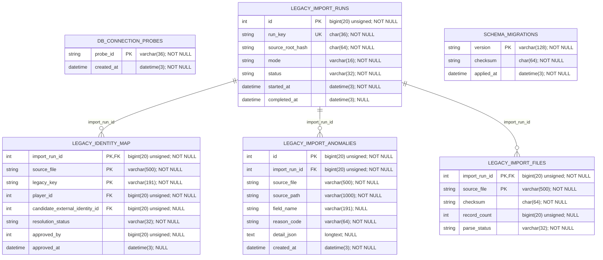

### 기타

```mermaid
erDiagram
  CHANNEL_MEMBERSHIP_EVENTS {
    int id PK "bigint(20) unsigned; NOT NULL"
    string event_id FK,UK "varchar(128); NOT NULL"
    int channel_id FK "bigint(20) unsigned; NOT NULL"
    int external_identity_id FK "bigint(20) unsigned; NOT NULL"
    string membership_event_code "varchar(32); NOT NULL"
    datetime occurred_at "datetime(3); NOT NULL"
  }
  PLAYER_BADGE_ASSIGNMENTS {
    int player_id PK,FK "bigint(20) unsigned; NOT NULL"
    string badge_code PK "varchar(128); NOT NULL"
    string display_value "varchar(500); NOT NULL"
    int priority "int(11); NOT NULL"
    datetime starts_at "datetime(3); NULL"
    datetime ends_at "datetime(3); NULL"
  }
  PLAYER_COUNTERS {
    int player_id PK,FK "bigint(20) unsigned; NOT NULL"
    string counter_code PK "varchar(128); NOT NULL"
    string period_key PK "varchar(64); NOT NULL"
    int value "bigint(20); NOT NULL"
    datetime updated_at "datetime(3); NOT NULL"
  }
  PLAYER_HOME_BADGE_CUBES {
    int player_id PK,FK "bigint(20) unsigned; NOT NULL"
    string badge_code PK "varchar(128); NOT NULL"
    decimal castle_percent "decimal(6,3); NOT NULL"
    decimal raid_percent "decimal(6,3); NOT NULL"
    decimal pet_upgrade_percent "decimal(6,3); NOT NULL"
    decimal explore_percent "decimal(6,3); NOT NULL"
    int equipped "tinyint(1); NOT NULL"
    int version "bigint(20) unsigned; NOT NULL"
    datetime updated_at "datetime(3); NOT NULL"
  }
  PLAYER_PASSES {
    int player_id PK,FK "bigint(20) unsigned; NOT NULL"
    string pass_code PK "varchar(128); NOT NULL"
    int enabled "tinyint(1); NOT NULL"
    int permanent "tinyint(1); NOT NULL"
    datetime starts_at "datetime(3); NULL"
    datetime ends_at "datetime(3); NULL"
  }
  PLAYER_PET_DAILY_RECORDS {
    int player_id PK,FK "bigint(20) unsigned; NOT NULL"
    datetime record_date PK "date; NOT NULL"
    int tower_attempts "bigint(20) unsigned; NOT NULL"
    int tower_floor "bigint(20) unsigned; NOT NULL"
    int castle_battle_attempts "bigint(20) unsigned; NOT NULL"
    int castle_battle_score "bigint(20); NOT NULL"
    string castle_rank_label "varchar(191); NULL"
    int mini_battle_attempts "bigint(20) unsigned; NOT NULL"
    int mini_battle_wins "bigint(20) unsigned; NOT NULL"
    int mini_battle_losses "bigint(20) unsigned; NOT NULL"
    int explore_attempts "bigint(20) unsigned; NOT NULL"
    int explore_wins "bigint(20) unsigned; NOT NULL"
    int explore_losses "bigint(20) unsigned; NOT NULL"
    int daily_quest_rewarded "tinyint(1); NOT NULL"
    int weekly_quest_count "bigint(20) unsigned; NOT NULL"
    int pet_home_comment_count "bigint(20) unsigned; NOT NULL"
    int feed_post_count "bigint(20) unsigned; NOT NULL"
    int home_alert_open_count "bigint(20) unsigned; NOT NULL"
    int version "bigint(20) unsigned; NOT NULL"
    datetime updated_at "datetime(3); NOT NULL"
  }
  PLAYER_PET_ELEMENTALS {
    int player_pet_id PK,FK "bigint(20) unsigned; NOT NULL"
    string display_name "varchar(191); NOT NULL"
    string grade_code "varchar(64); NOT NULL"
    string grade_display_name "varchar(191); NOT NULL"
    int enhancement_level "bigint(20) unsigned; NOT NULL"
    int raid_charm "bigint(20) unsigned; NOT NULL"
    int castle_charm "bigint(20) unsigned; NOT NULL"
    int version "bigint(20) unsigned; NOT NULL"
  }
  PLAYER_PET_INTIMACY {
    int player_pet_id PK,FK "bigint(20) unsigned; NOT NULL"
    int intimacy_level "bigint(20) unsigned; NOT NULL"
    int progress "bigint(20) unsigned; NOT NULL"
    int charm "bigint(20) unsigned; NOT NULL"
    int version "bigint(20) unsigned; NOT NULL"
    datetime updated_at "datetime(3); NOT NULL"
  }
  PLAYER_PET_PENDANTS {
    int player_pet_id PK,FK "bigint(20) unsigned; NOT NULL"
    string display_name "varchar(191); NOT NULL"
    string grade_code "varchar(64); NOT NULL"
    string grade_display_name "varchar(191); NOT NULL"
    int durability "bigint(20) unsigned; NULL"
    int max_durability "bigint(20) unsigned; NULL"
    int enhancement_level "bigint(20) unsigned; NOT NULL"
    int raid_charm "bigint(20) unsigned; NOT NULL"
    int castle_charm "bigint(20) unsigned; NOT NULL"
    int version "bigint(20) unsigned; NOT NULL"
  }
  PLAYER_TITLES {
    int player_id PK,FK "bigint(20) unsigned; NOT NULL"
    int title_id PK,FK "bigint(20) unsigned; NOT NULL"
    datetime acquired_at "datetime(3); NULL"
    int equipped "tinyint(1); NOT NULL"
  }
  PRE_SIGNUP_ATTENDANCE {
    int id PK "bigint(20) unsigned; NOT NULL"
    int external_identity_id FK,UK "bigint(20) unsigned; NULL"
    string legacy_display_name "varchar(191); NOT NULL"
    string normalized_display_name "varchar(191); NOT NULL"
    int attendance_count "bigint(20) unsigned; NOT NULL"
    datetime last_attended_on "date; NULL"
    int game_server_id FK "bigint(20) unsigned; NULL"
    string status "varchar(32); NOT NULL"
    int migrated_player_id FK "bigint(20) unsigned; NULL"
    int source_import_run_id FK "bigint(20) unsigned; NULL"
    int version "bigint(20) unsigned; NOT NULL"
    datetime created_at "datetime(3); NOT NULL"
    datetime updated_at "datetime(3); NOT NULL"
    datetime migrated_at "datetime(3); NULL"
  }
  SKILL_DEFINITIONS {
    int id PK "bigint(20) unsigned; NOT NULL"
    string code UK "varchar(128); NOT NULL"
    string display_name "varchar(191); NOT NULL"
    text rules_json "longtext; NULL"
    int active "tinyint(1); NOT NULL"
  }
  TITLE_DEFINITIONS {
    int id PK "bigint(20) unsigned; NOT NULL"
    string code UK "varchar(128); NOT NULL"
    text display_name "text; NOT NULL"
    string scope_code "varchar(32); NOT NULL"
    int active "tinyint(1); NOT NULL"
  }
  TITLE_DEFINITIONS ||--o{ PLAYER_TITLES : "title_id"
```

<!-- GENERATED COLUMN ERD END -->
