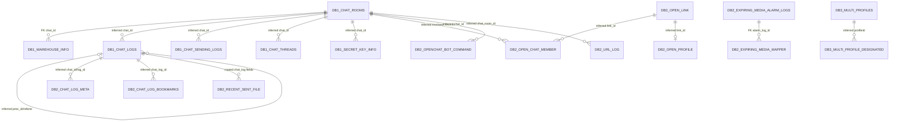

# KakaoTalk Iris `/query` schema inventory and ERD

Snapshot date: 2026-08-06 KST

This document records the SQLite databases that the running redroid Iris `/query` endpoint can actually access. It is a schema and row-count inventory, not a copy of KakaoTalk content. Message bodies, attachment URLs, profile image URLs, phone numbers, encryption keys, and other personal or secret values are intentionally excluded.

## 1. Query boundary

Iris currently attaches four SQLite aliases.

| Alias | Role | Physical tables |
|---|---|---:|
| `main` | Empty Iris query connection database | 1 |
| `db1` | KakaoTalk chat database | 10 |
| `db2` | KakaoTalk auxiliary/content/profile cache database | 33 |
| `db3` | KakaoTalk multi-profile database | 5 |
| Total | Physical tables across aliases | 49 |

Discovery query:

```sql
SELECT * FROM pragma_database_list;
```

Schema query:

```sql
SELECT name, type, sql
FROM db1.sqlite_master
WHERE type IN ('table', 'view')
ORDER BY type, name;
```

Replace `db1` with `db2` or `db3`. Unqualified `chat_logs` and `chat_rooms` are routed by Iris, but schema inspection must use the explicit `db1` alias.

## 2. Core ERD

Solid relationship labels are declared SQLite foreign keys. Labels beginning with `inferred` are relationships derived from matching columns and KakaoTalk behavior; the database does not enforce them.



Important identity boundary:

```text
chat_logs.user_id
    ├─ open chat only: db2.open_chat_member.user_id + link_id
    ├─ recommended cache only: db2.recommended_friends.user_id
    ├─ own/open profiles: db2.open_profile or db3.multi_profiles
    └─ normal MultiChat participant name: not available in the current attached schema
```

There is no `db2.friends` table in this runtime. A `/query` request against it returns SQLite `no such table`. Therefore `chat_logs.user_id` cannot always be resolved to a current normal-chat display name.

## 3. `main` inventory

| Table | Rows | Key columns | Stored data |
|---|---:|---|---|
| `android_metadata` | 1 | `locale` | SQLite Android locale metadata |

## 4. `db1` chat database inventory

| Table | Rows | Key columns | Stored data | hoiBot use |
|---|---:|---|---|---|
| `android_metadata` | 1 | `locale` | Android locale metadata | None |
| `chat_logs` | 1,466 | `_id` PK, `id`, `chat_id`, `user_id`, `type`, `message`, `attachment`, `created_at`, `deleted_at`, `prev_id`, `referer`, `v` | Received/sent chat log state and event correlation fields | Event identity, type, direction and correlation only; do not copy content by default |
| `chat_rooms` | 6 | `_id` PK, `id`, `type`, `members`, `active_member_ids`, `last_log_id`, `unread_count`, `meta`, `link_id`, `v` | Room state, membership ID arrays, unread/read cursors and cached metadata | Channel identity and room-level diagnostics |
| `chat_sending_logs` | 0 | `_id` PK, `chat_id`, `type`, `message`, `attachment`, `client_message_id`, `is_silence` | Pending/local outgoing messages | Diagnostic only |
| `chat_threads` | 26 | PK `chat_id + thread_id`, read/display/new log IDs, mention flags, count | Thread and unread state | Future read/thread analysis only |
| `public_key_info` | 0 | `_id` PK, `user_id`, key tokens, encrypted/signing keys | Encryption material | Never ingest or expose |
| `room_master_table` | 1 | `id`, `identity_hash` | Android Room schema identity | Schema verification only |
| `secret_key_info` | 0 | `_id` PK, `chat_id`, secret-key token/value | Encryption material | Never ingest or expose |
| `sqlite_sequence` | 3 | `name`, `seq` | SQLite autoincrement counters | None |
| `warehouse_info` | 0 | `_id` PK, `chat_id` FK, name, host, permissions, restrictions | Warehouse/community chat configuration | Not currently used |

Observed `chat_logs.type` distribution at snapshot time:

| Type | Rows | Current interpretation |
|---:|---:|---|
| 1 | 1,288 | Text; mention/reply requires payload metadata inspection |
| 26 | 47 | Sticker/emoticon family candidate |
| 2 | 31 | Single image |
| 0 | 26 | System/unknown candidate; verify per payload |
| 20 | 25 | Animated sticker candidate |
| 71 | 16 | Rich/search card candidate |
| 16385 | 13 | Extended/system variant; unverified |
| 12 | 10 | Reply/feed-related candidate; verify per payload |
| 3 | 5 | Video |
| 16386 | 3 | Extended media/system variant; unverified |
| 27 | 3 | Multiple images |
| 5 | 1 | Media/event candidate; unverified |

Observed room types: `DirectChat=1`, `MultiChat=1`, `OM=2`, `PlusChat=2`.

### `chat_logs` adapter contract

| Column | Role | Server rule |
| --- | --- | --- |
| `_id` | Local SQLite cursor | Local ingestion ordering only; can reset with app data |
| `id` | Provider log ID | Preserve as decimal string; primary event correlation key |
| `type` | Kakao type code | Combine with parsed `v.origin`; never classify alone |
| `chat_id` | Conversation ID | Preserve as string; room-scoped routing and query key |
| `thread_id` | Optional thread ID | Preserve as nullable string; semantics require event evidence |
| `scope` | Delivery/scope metadata | Preserve only for diagnostics until verified |
| `user_id` | Provider user ID | Preserve as string; never replace with display text |
| `message` | Decrypted text or system-event JSON | Parse as JSON only for verified event shapes |
| `attachment` | Type-specific JSON | Parse once and validate against the event family |
| `created_at` | Provider timestamp | Preserve raw, then normalize in a timestamp adapter |
| `deleted_at` | Deletion state candidate | Never use as the sole deletion signal |
| `client_message_id` | Client send correlation | Preserve as string; scope remains event-dependent |
| `prev_id` | Previous-log pointer | Preserve as string; optional correlation hop |
| `referer` | Referenced-log pointer | Preserve as string; verify semantics by event |
| `supplement` | Optional extension JSON | Parse only when present |
| `v` | Transport metadata JSON | Parse once and retain approved normalized fields |

The Iris wrapper maps decrypted text to top-level `msg`, mutable display labels to `room` and `sender`, and the source row to top-level `json`. `v`, `attachment`, and `supplement` may arrive as JSON-encoded strings. A parse failure leaves the field unclassified instead of failing ingestion. Large identifiers and timestamps may arrive as decimal strings and must never pass through JavaScript `number`.

## 5. `db2` auxiliary database inventory

| Table | Rows | Key columns | Stored data | Sensitivity/use |
|---|---:|---|---|---|
| `android_metadata` | 1 | `locale` | Android locale metadata | None |
| `call_log` | 0 | `call_log_id` PK, `chat_room_id`, call type/time | Talk call summary | Event candidate only |
| `chat_log_bookmarks` | 0 | `bookmark_id` PK, `chat_id`, `chat_log_id`, memo | User chat bookmarks | Private; do not ingest |
| `chat_log_meta` | 0 | PK `chat_id + log_id + type`, content, revision | Extra chat-log metadata | Correlation candidate |
| `emoticon_instant_keyword` | 0 | `_id` PK, `kid`, usage counters | Emoticon keyword usage | None |
| `emoticon_keyword_dictionary` | 4,214 | `keyword_id` PK, keyword, matching texts | Kakao emoticon dictionary | Catalog/reference only |
| `emoticon_tag_dictionary` | 0 | `tag_id` PK, tag name | Emoticon tags | Catalog/reference only |
| `expiring_media_alarm_log_chat_log_mapper` | 0 | composite PK, `alarm_log_id` FK, `chat_log_id` | Expiring-media alarm to chat mapping | Event correlation only |
| `expiring_media_alarm_logs` | 0 | `_id` PK, control policy, read/time fields | Expiring-media alarm state | Event candidate only |
| `favorite_emoticons` | 0 | PK `item_id + emot_idx` | User favorite emoticons | Private preference; do not ingest |
| `file_path` | 0 | `token` PK, name, path | Local file paths | Sensitive; never expose |
| `friend_tab_post_viewable_event` | 0 | `id` PK, post ID, viewing duration | Friend-tab viewing analytics | Private; do not ingest |
| `geo_location_log` | 0 | `_id` PK, time, OS, purpose | Location-use audit metadata | Sensitive; never ingest |
| `inapp_browser_url` | 0 | `_id` PK, title, URL, time | In-app browsing history | Sensitive; never ingest |
| `item` | 6 | `id` PK, category, order, encryption metadata | Kakao item/emoticon state | Not hoiBot game items |
| `item_resource` | 310 | `_id` PK, item category/ID, metadata | Kakao item resources | Not hoiBot game items |
| `music_history` | 0 | `song_id` PK, title/artist/URL/play data | Kakao music history | Private; do not ingest |
| `music_playlist` | 0 | `_id` PK, song metadata | Kakao music playlist | Private; do not ingest |
| `music_recent_playlist` | 0 | `_id` PK, title/writer/song IDs | Recent music playlist | Private; do not ingest |
| `open_chat_member` | 144 | `_id` PK, unique `user_id + link_id`, nickname, profile URLs, `involved_chat_id` | Cached open-chat member profiles | Current open-chat nickname candidate; never use alone for authorization |
| `open_link` | 2 | `id` PK, owner `user_id`, name, URL, image, type/status | Open-chat room/profile links | Open-chat title and link metadata |
| `open_profile` | 2 | `link_id` PK, `user_id`, nickname, profile URLs | Open-chat profiles | Profile candidate; scope by link ID |
| `openchat_bot_command` | 0 | `id` PK, bot/chat/link IDs, name, revision | Kakao open-chat bot command definitions | None |
| `plusfriend_add_info` | 0 | `uuid` PK, profile/click/ad IDs | Plus-friend attribution | Private; do not ingest |
| `recent_sent_file` | 0 | `messageId` PK and copied chat-log columns | Recently sent file message cache | Sensitive; do not ingest |
| `recently_emoticons` | 0 | `emoticon_id` PK, usage counters | Recently used emoticons | Private preference |
| `recently_reactions` | 0 | PK `kind + object`, usage counters | Recently used reactions | Private preference |
| `recommended_friends` | 8 | `_id` PK, unique `user_id`, nickname, profile/phone/account fields | Recommended-friend cache | Highly sensitive; do not ingest or expose |
| `room_master_table` | 1 | `id`, `identity_hash` | Android Room schema identity | Schema verification only |
| `s2_events` | 0 | `_id` PK, page/action/metadata/time | Kakao analytics events | Private; do not ingest |
| `sqlite_sequence` | 4 | `name`, `seq` | SQLite autoincrement counters | None |
| `tch_chat_log_meta` | 0 | `chat_log_id` PK, service/message IDs, value | Talk-channel chat metadata | Correlation candidate |
| `url_log` | 17 | `chat_id` PK, `chat_room_id`, URL/title/image/user/time | Link preview cache | Content-sensitive; metadata only if explicitly required |

Name coverage at snapshot time:

| Source | Rows | Rows with a name | Scope |
|---|---:|---:|---|
| `open_chat_member.nickname` | 144 | 144 | Open-chat membership cache |
| `open_profile.nickname` | 2 | 2 | Open-chat profile cache |
| `recommended_friends.nick_name` | 8 | 8 | Recommendation cache; not proof of room membership |

## 6. `db3` multi-profile inventory

| Table | Rows | Key columns | Stored data | Sensitivity/use |
|---|---:|---|---|---|
| `android_metadata` | 1 | `locale` | Android locale metadata | None |
| `ddays` | 0 | `id` PK, subject/date/repeat/category | User D-day data | Private; do not ingest |
| `multi_profile_designated` | 0 | `userId` PK, `profileId` | Friend-to-multi-profile assignment | Sensitive; never use as general identity proof |
| `multi_profiles` | 1 | `profileId` PK, nickname, profile URLs, status, main flag | Local account's multi-profile definitions | Own-account profile data, not arbitrary room participant names |
| `room_master_table` | 1 | `id`, `identity_hash` | Android Room schema identity | Schema verification only |

## 7. Exact `.` name search result

The exact value `.` was searched as a name, not as a message body.

| Source | Exact matches |
|---|---:|
| Recent Iris payload `sender` (latest 50 events) | 0 |
| hoiBot canonical external identity name | 0 |
| hoiBot observed external identity name | 0 |
| `db2.open_chat_member.nickname` | 0 |
| `db2.open_profile.nickname` | 0 |
| `db2.recommended_friends.nick_name` | 0 |
| `db3.multi_profiles.nickName` | 0 |

The KakaoTalk UI screenshot can show `.` while none of the databases attached to Iris exposes that value. For the reported image events, the stable event identifier remains the event's `user_id`; Iris supplied different stale untrusted labels for that same ID at different times. The operational user ID and labels are intentionally not retained in this reference document.

## 8. Safe reusable queries

List databases:

```json
{
  "query": "SELECT * FROM pragma_database_list",
  "bind": []
}
```

List tables without reading content:

```json
{
  "query": "SELECT name, sql FROM db2.sqlite_master WHERE type = 'table' ORDER BY name",
  "bind": []
}
```

Resolve an open-chat nickname by both room link and user ID:

```json
{
  "query": "SELECT member.user_id, member.nickname, member.link_id FROM db2.open_chat_member AS member JOIN db1.chat_rooms AS room ON room.link_id = member.link_id WHERE room.id = ? AND member.user_id = ? LIMIT 2",
  "bind": ["<chat_id>", "<user_id>"]
}
```

Read one chat event without scanning content:

```json
{
  "query": "SELECT id, chat_id, user_id, type, created_at, deleted_at, prev_id, referer, v FROM db1.chat_logs WHERE id = ? AND chat_id = ? LIMIT 2",
  "bind": ["<event_id>", "<chat_id>"]
}
```

All external values must remain in `bind`; never concatenate room IDs, user IDs, names, or messages into SQL text.

## 9. hoiBot adoption rules

- Use `chat_logs.id`, `chat_id`, `user_id`, `type`, timestamps and correlation IDs for event processing.
- Treat Iris `sender` as an untrusted cache observation.
- Treat `open_chat_member.nickname` as a room-scoped candidate, not proof of account ownership.
- Resolve a hoiBot user through verified `(provider_code, external_user_id) -> player_id` linkage.
- Do not ingest Kakao encryption keys, phone numbers, browsing/location history, local paths, message bodies, media URLs, or recommendation data.
- Do not claim profile-change, read-receipt, kick, or current normal-chat nickname detection until a stable table mutation and event correlation have been verified.
- Row counts are a live snapshot and will change as KakaoTalk runs.
